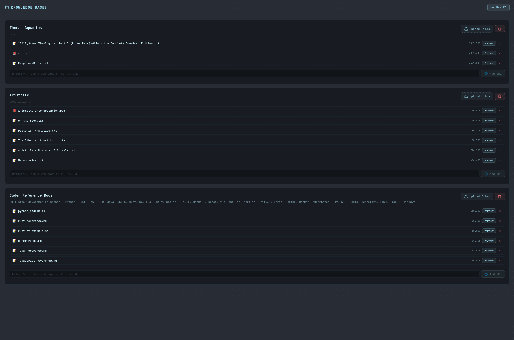

<p align="center">
  
</p>

<h1 align="center">HyprChat</h1>

<p align="center">
  <strong>Self-hosted AI chat platform</strong> — conversational coding, Daedalus project workflows, web research, a personal assistant, image generation, voice, councils, and model management.
</p>

<p align="center">
  Built with FastAPI + a Vite-compiled React SPA. Local-first with no required cloud dependencies — optional OpenAI, Anthropic, and any OpenAI-compatible provider via your own API keys.
</p>

<p align="center">
  <code>FastAPI</code> · <code>React 18</code> · <code>Vite</code> · <code>Ollama</code> · <code>SQLite</code> · <code>SearXNG</code> · <code>ComfyUI</code> · <code>Codebox</code> · <code>PWA</code>
</p>

> ⚠️ Alpha software — actively developed, expect rough edges. See the [changelog](CHANGELOG.md) for changes and [releases](https://github.com/eefernet/hyprchat/releases) for published versions. Experimental Daedalus persistent jobs remain disabled by default.

[Quick Start](#quick-start) · [Feature Tour](#feature-tour) · [Configuration](#configuration) · [Deployment](#deployment) · [Operations](#operations-and-verification) · [Development](#development) · [Documentation](#documentation)

---

## ⚠️ Security Warning

HyprChat can execute code, upload files, call local services, and drive coding agents. **Do not expose it directly to the public internet.** Run it behind Tailscale, a VPN, or a reverse proxy with authentication. The default configuration binds to `127.0.0.1` and assumes a trusted local network.

---

## What It Is

HyprChat is a local-first replacement for hosted AI chat apps and OpenWebUI-style dashboards. One FastAPI service and one Vite-built React app bring together chat, model management, research, knowledge bases, coding help, project workflows, and personal-assistant tools. Optional services add code execution, images, and voice. Install it to your home screen as a PWA for mobile access.

<p align="center">
  
</p>

## Highlights

| Area | What you get |
|---|---|
| 💬 Chat | SSE streaming, syntax-highlighted code, diagrams/charts/math, thinking tokens, live tok/s stats, continue, ratings, slash commands, forks, search, tags, exports |
| 🧭 Routing | Optional Auto model — each message is classified locally and routed to the model you configured per category (chat / code / reasoning / long-context) |
| ☁️ Cloud models | OpenAI/Anthropic with native tool calling and estimated spend; custom OpenAI-compatible endpoints with text-based tool fallback |
| 🧑‍💻 Master Developer | Coding explanations, debugging, reviews, and examples across languages, using Coder Docs and Quick Search |
| 🏛️ Daedalus | Architect → Builder → Reviewer → Acceptance workflow for building and fixing projects, with server-enforced gates |
| 🔎 Research | Optional Quick Search for relevant turns, source cards, and Deep Research with investigative reports and durable history |
| 🤖 Jarvis | Personal assistant, scheduled briefs/tasks, notifications, notes, calendar/CalDAV, email, and event automations |
| 🧰 Tools | Code execution, shell/file tools, URL fetch, custom Python tools, uploaded project awareness |
| 🎨 Images | Local ComfyUI generation from chat or Image Studio — LoRAs, saved workflows, persona selfies, prompt enhancement |
| 🎙️ Voice | Browser microphone transcription and assistant reply playback through proxied STT/TTS services |
| 🔌 Connectors | MCP servers and OpenAPI specs discovered into chat-usable tools, with credential placeholders and private-URL guards |
| 📚 Knowledge | Hybrid RAG, inline `[n]` citations, optional reranking, URL ingestion, scanned-PDF OCR, and maintained coding references |
| 🧠 Memory | Global user memory, workspace memory with reviewed suggestions, cross-chat history recall, and Ghost Mode for unsaved chats |
| 📁 Artifacts | Artifact Studio tracks delivered files, projects, and images — plus a full-screen Canvas editor with AI-assisted edits |
| 🗳️ Councils | Run multiple models in parallel, debate answers, vote, and synthesize the result |
| 📦 Models | Ollama model browser, HuggingFace GGUF downloads, HyprFit hardware-fit recommendations, capability badges |
| 🧩 Profiles | Task agents and conversational personas, per-profile models, tools, knowledge bases, and appearance settings |
| 📱 PWA | Installable web app with offline shell caching, served over HTTPS via Tailscale Serve |
| 💾 Backup | One-click full data backup with secret scrubbing, and staged safe restore |

## Quick Start

### Prerequisites

- **Python 3.11+** for the backend; local development also needs the standard `venv` module.
- **Node.js 22+ and npm** on the machine building the frontend. The deployed server serves the generated files and does not need Node.
- **Ollama and an installed chat model** for local chat. Choose a model that fits your hardware; cloud providers can be configured separately in Settings → Connections. Local helper and embedding features still use Ollama.
- **Optional services** unlock search, code execution, images, and voice; see the [service table](#configuration).

### Local Development

From a terminal with Python and Node available:

```bash
git clone https://github.com/eefernet/hyprchat.git
cd hyprchat
```

The clone uses the repository's default branch. To try changes awaiting merge, run `git switch dev` before installing and building. For a published snapshot, choose a version from [releases](https://github.com/eefernet/hyprchat/releases).

Replace `<installed-chat-model>` below with a model already available on your Ollama server. These exports use that model for chat and local helper tasks; you can choose separate models later in Settings.

```bash
python3 -m venv .venv
source .venv/bin/activate
python3 -m pip install -r backend/requirements.txt
( cd frontend && npm ci && npm run build )

export OLLAMA_URL='http://127.0.0.1:11434'
export DEFAULT_MODEL='<installed-chat-model>'
export WORKSPACE_MODEL="$DEFAULT_MODEL"
export PLANNING_MODEL="$DEFAULT_MODEL"
export CODER_MODEL="$DEFAULT_MODEL"

( cd backend && HOST=127.0.0.1 PORT=8000 python3 main.py )
```

Open **http://127.0.0.1:8000** and select your model. Storage defaults to the checkout's `data/` directory. The local launch reads exported environment variables; it does not automatically load a `.env` file. Knowledge-base indexing also needs the configured Ollama embedding model (default `nomic-embed-text`).

### Server Installation

The provided installer targets a Debian/Ubuntu server at `/opt/hyprchat`:

1. Clone or copy the source checkout into `/opt/hyprchat` on the server.
2. Build the frontend on your development machine with `cd frontend && npm ci && npm run build`. Copy the **whole** resulting `frontend/dist/` directory to `/opt/hyprchat/frontend/dist/` on the server; it is not included in Git.
3. On the server, create the environment file if absent and edit its service URLs, model names, and bind address:

   ```bash
   cd /opt/hyprchat
   if [ ! -f .env ]; then sudo cp .env.example .env; fi
   sudoedit .env
   sudo bash scripts/deploy.sh
   ```

The installer preserves an existing `.env`, creates the `hyprchat` service user and data directories, installs backend dependencies, and starts systemd. The shipped unit runs `/usr/bin/python3` with **one Uvicorn worker** and loads `/opt/hyprchat/.env`. Check the installed unit before using a different Python environment for maintenance.

The default bind is `127.0.0.1:8000`. Use a private bind address or authenticated proxy for remote access, then run the [verification checks](#operations-and-verification). Proxmox container creation scripts are optional helpers for the reference homelab, not prerequisites for a normal server install.

## Feature Tour

### 💬 Rich Chat

Use HyprChat like a normal chat app, then turn on heavier tools only when needed. Messages stream live with tokens/sec in the header, render structured output inline, and can be forked, searched, tagged, exported, or attached to workspaces.

- **Continue truncated replies** — responses cut off by the output-token limit get a ▶ continue button that resumes the same message in place.
- **Message ratings** — 👍/👎 on assistant replies, persisted per message and totaled in Statistics.
- **Slash commands** — type `/` in the composer to search and insert Prompt Library prompts, with `{{variable}}` placeholders filled via an inline form.
- **Syntax highlighting** — language-tagged code blocks use light/dark token colors, readable labels, and copy controls. Supported grammars include Swift, Python, JavaScript/TypeScript, JSX/TSX, SQL, and other common languages; unsupported labels retain plain code.
- **Auto-compaction** — optionally summarize older turns when a conversation nears its context window. Summaries retain useful context but may omit details.
- **Smart model routing** — enable the 🧭 Auto model and each message is classified locally (chat/code/reasoning, plus a deterministic long-context check) and routed to the model you configured per category. The footer shows which model answered.

<p align="center">
  
  
  
  
</p>

### 📦 Models — Local & Cloud

Manage installed Ollama models, browse HuggingFace GGUF files, watch active downloads, and let HyprFit rank pull candidates against your saved or detected hardware profile (including remote Ollama hosts scanned over SSH).

Cloud models sit alongside local ones in the same picker with prefixed IDs:

- **OpenAI & Anthropic** — add API keys in Settings → Connections and the models appear as `openai:<model>` / `anthropic:<model>`.
- **Custom (OpenAI-compatible)** — configure a compatible endpoint (OpenRouter, Groq, Mistral, vLLM, llama.cpp, LiteLLM) with its base URL, optional key, and display name. Models appear as `custom:<model>`; thinking, vision, and usage depend on what that endpoint and model support.
- **Tool calling** — OpenAI/Anthropic use native provider tools, with a text fallback when rejected. Ollama also retains native-to-text fallback. Custom providers use the text protocol.
- **Cost tracking** — Statistics shows estimated spend for priced OpenAI/Anthropic models, with per-model and today/30-day/all-time totals. Local and custom models are not priced by the built-in table.

HyprFit's hardware-fit ranking model is adapted from the MIT-licensed llmfit/Pewdiepie Odysseus Cookbook approach; see [docs/licenses/llmfit-MIT-LICENSE.txt](docs/licenses/llmfit-MIT-LICENSE.txt).

<p align="center">
  
  
</p>

### 🧑‍💻 Master Developer

Choose **Master Developer** for explanations, debugging, code reviews, and focused examples in any language. It uses the existing chat tools, attached **Coder Reference Docs**, and Quick Search; ordinary coding questions do not start a Daedalus project.

Select it in the persona picker. If it is missing, use **Restore Defaults** in the Agents/Personas panel, then choose an available model. The seed attaches your owned Coder Reference Docs KB when present; it does not download the library. Follow the [Coder Docs guide](docs/coder-docs.md) to populate or refresh it, then restore the persona again to attach a newly created KB.

The library spans languages, web frameworks, mobile/game development, databases, and tooling, including **Swift and SwiftUI**. Refreshes preserve existing references when a fetch or indexing step fails, and retrieved Markdown retains code indentation and source/version notes. Small code checks use available runtimes; SwiftUI/iOS builds require an appropriate Apple development environment.

### 🏛️ Daedalus Agentic Coding

Use Daedalus to plan, build, review, repair, and package projects. The default workflow runs Architect and Builder on separate turns: `plan_project` returns a structured plan, then a later `generate_code` call starts Builder with that plan and advisory interface guidance. A unified workflow card shows progress through review, repair, acceptance, and packaging.

<p align="center">
  
</p>

| Agent | Role |
|---|---|
| 📐 Architect | Creates a structured plan, file tree, commands, dependencies, success criteria, and optional interface contract |
| 🏗️ Builder | Uses OpenHands in Codebox for greenfield builds, with scaled rounds and bounded missing-file continuation |
| 🔍 Reviewer | Runs real build/test/lint commands and returns concrete issues |
| 🛠️ Aider Fixer | Applies focused repairs to existing project roots, including uploads and Builder-created projects |
| 🔧 Fixer | Fallback scoped editor when Aider is disabled, unhealthy, or cannot produce a patch |
| ✅ Acceptance | Final gate for request fit, docs, tests, packaging, and generated artifacts |
| ❓ ProjectQA | Answers codebase questions with grounded file references |

Server-side gates manage review, acceptance, repair limits, and repeated blockers. Delivered project archives exclude generated/cache/build outputs and Aider runtime metadata.

**Experimental persistent jobs** add background execution, checkpoint continuation, restart recovery, Settings-owned context budgets, repository/evidence browsing, and downloads tied to the accepted revision. This workflow is **opt-in and disabled by default**; its local-model evaluation has not met promotion requirements. See the [Daedalus workflow guide](docs/daedalus-workflows.md) for both paths and their limitations.

### 🧰 Tools & Quick Search

Built-in tools cover code execution, file operations, shell commands, direct URL reading, research, and custom uploaded Python tools. MCP and OpenAPI connectors expose enabled external operations through the same chat tool path.

Enable **Quick Search** in the composer or through a profile to add current sources before the model answers. It skips turns that do not need search and recognizes pasted code, language/API names, and coding follow-ups. SearXNG result cards, thumbnails, and page excerpts appear above the answer.

The shared search pipeline combines deterministic queries with optional local-model planning and embedding reranking. It keeps completed results within a time budget and distinguishes empty results from provider failures. Chat search, the model's research tool, and councils share this pipeline; Deep Research retains its iterative workflow. See [web search](docs/web-search.md) and [SearXNG operations](scripts/searxng/README.md).

<p align="center">
  
</p>

### 🔎 Deep Research

Deep Research runs multi-step searches, reads pages, cross-checks sources, and writes durable reports you can revisit, export, print, or add to a workspace. Starting a report opens a dedicated full-page composer with report type, model, context, and source settings, and finished reports live in a browsable history.

The **Investigative Dossier** template also draws on government, court, FOIA, and investigative-document sources, with a source index aligned to the report's inline citations.

<p align="center">
  
  
</p>

### 🤖 Jarvis Personal Assistant

Open **Assistant** to set up a personal assistant with a pinned conversation and scheduled check-in briefs. Briefs can gather tasks, notifications, notes, calendar, email, and weather into an update you can read or play aloud.

- **Tasks and automations** — run prompts once, daily, weekly, monthly, or on a cron schedule; trigger tasks from events or webhooks. Tasks use the normal chat agent and its enabled tools.
- **Notifications** — in-app notifications plus optional ntfy and email delivery, with timezone-aware quiet hours and an urgent override.
- **Notes and calendar** — notes/todos, reminders, month/week/day views, and two-way CalDAV sync, available through panels and chat tools.
- **Email** — connect IMAP/SMTP accounts for triage, reading, threaded replies, and mailbox actions. HTML messages render in a sanitized, sandboxed reader.
- **Automation controls** — autonomous sending requires both the assistant-wide and account-level permissions; autonomous deletion is controlled per account and moves messages to Trash. Configure these in Assistant and Email settings.

The scheduler runs inside HyprChat. Calendar, email, push, and weather integrations are optional; n8n is not required for scheduled tasks. Briefs and tools depend on the configured services and models being available.

### 🎨 Image Generation & Image Studio

Generate pictures directly in chat with the `generate_image` tool, or use Image Studio for a full ComfyUI control surface. Chat images render inline, are stored as artifacts, and can use global defaults for checkpoint, workflow, resolution, VAE, prompt prefix, negative prompt, and compose model.

Image Studio supports local Stable Diffusion and Flux-style ComfyUI workflows, checkpoint/VAE selection, LoRAs, seed lock/randomize, slider-based steps/CFG, extra SDXL aspect ratios, sampler and scheduler defaults, model-sampling presets, saved API workflows from JSON or workflow-bearing PNG uploads, prompt enhancement, thumbnail galleries, lightbox preview, artifact reuse, full-trace purge, and ComfyUI memory controls. HyprChat injects v-prediction or flow sampling nodes only when the workflow does not already contain the matching mode, and defers ComfyUI cleanup while any generation or prompt submission is still in flight.

<p align="center">
  
</p>

<p align="center">
  
  
</p>

<p align="center">
  
</p>

### 🎙️ Voice

Voice is optional and local-service friendly. The composer can record from the browser microphone and send audio to HyprChat for speech-to-text, while assistant messages can be read aloud through text-to-speech with per-voice selection and optional auto-play.

The browser only talks to HyprChat. The backend proxies OpenAI-compatible STT and TTS services such as Speaches/Whisper and kokoro-fastapi, which avoids CORS issues and keeps those LAN services off the public browser surface.

### 📁 Artifacts & Canvas Editor

Artifact Studio is the library for everything HyprChat delivers — files, project archives, and generated images — with search and filters, previews, timelines, duplicate merge, revisions, bundles, add-to-KB, send-to-research, use-in-chat, and fork-to-Codebox.

Text-like artifacts (text, markdown, code, JSON, HTML) open in a full-screen **Canvas editor** — syntax-highlighted CodeMirror with a ✏️ Edit button in the detail panel. Select any text and describe a change, and **AI Edit** proposes a rewrite with a before/after diff you can apply or reject. Saving always creates a new revision; originals are never overwritten.

<p align="center">
  
</p>

### 🗳️ Councils

Councils run multiple models against the same prompt, optionally debate across rounds, vote on the best answer, and synthesize the final result. Council members can link to personas, inheriting the persona's model, prompt, and name at runtime, and council chats show address panels, round sections, peer ballots, and moderator verdicts.

<p align="center">
  
</p>

### 📚 Knowledge Bases & Workspaces

Upload documents, attach knowledge bases to profiles, index uploaded code projects, and group related chats into workspaces. Workspaces can analyze topics and generate profile prompts from accumulated context.

KB answers use **hybrid retrieval** (ChromaDB vectors + SQLite FTS5 keywords, fused) and render clickable inline `[n]` citation chips.

- **Add URL** — paste a web page or PDF URL into a KB card; it is fetched SSRF-safely, extracted, stored as markdown with source provenance, and indexed like an upload. Re-adding the same URL updates in place.
- **Smart KB Reranking** — optional local-model scoring improves relevance before answering; errors fall back to normal ranking.
- **Scanned-PDF OCR** — PDFs with no text layer (scans, faxes, photographed docs) are OCR'd automatically during KB upload and chat PDF extraction (RapidOCR, CPU-only, up to 50 pages).
- **Coder Reference Docs** — a managed coding library with source/version metadata and incremental refreshes. User-added documents outside its catalog remain untouched; see the [maintenance guide](docs/coder-docs.md).

<p align="center">
  
  
</p>

### 🧠 Memory & History Recall

Global memory stores user-level context; workspace memory adds reviewed suggestions and pinned instructions for a project. Only accepted/current memories are injected, and explicit requests to remember something can save an accepted memory directly. Ghost Mode avoids saved chat history and excludes KB/memory context.

**Chat-history recall** extends memory across conversations: turns from memory-enabled chats are indexed into ChromaDB, a `search_history` tool lets the model answer "what did we decide about X?" from past conversations, and the Memory panel gains a semantic + keyword Search Past Conversations box. Edits re-index and deletes clean up.

### 🧩 Agents & Personas

Agents are task profiles for coding, research, automation, and tool-heavy work. Personas cover conversational roles such as Master Developer as well as character and roleplay profiles. Each can have its own model, prompt, avatar, tools, knowledge bases, and generation settings. Character personas also support appearance context for photos and age-rating controls for adult content.

<p align="center">
  
  
</p>

### 📱 PWA & Mobile Access

HyprChat ships a web app manifest, icons, and a network-first service worker, so it installs to your phone's home screen or desktop dock like a native app. The service worker only keeps the app shell loadable — it never touches API traffic.

Installation requires HTTPS. The reference setup uses **Tailscale Serve** to proxy `https://hyprchat.<tailnet>.ts.net` to the backend with an automatic valid certificate — no cert management, tailnet-only exposure, and it also unlocks the microphone without browser flags.

### ⚙️ Settings, Analytics, Backup

Settings covers appearance, generation defaults, RAG, Daedalus, images, voice, backgrounds, and service connections. The navigation rail can be reordered or customized per profile. Statistics tracks token usage, tokens/sec, estimated cloud spend, message ratings, and service health history; the activity monitor watches downloads and long-running jobs.

**Backup & Restore** (Settings → Danger Zone) produces a one-click full data backup — a consistent SQLite copy with provider keys and connector secrets scrubbed, plus uploads, knowledge bases, and settings. Restores stage safely and apply on the next service restart, keeping the previous database as a `.pre-restore` copy.

<p align="center">
  
  
</p>

## Configuration

Configure service connections and models in **Settings**. Environment variables supply startup defaults; [`.env.example`](.env.example) is the server-install template, and [`backend/config.py`](backend/config.py) defines source defaults.

| Capability | Service / configuration | Typical port |
|---|---|---|
| Local chat and helpers | Ollama — `OLLAMA_URL`; choose installed chat/helper models | `11434` |
| Knowledge bases | Ollama embeddings — `EMBED_MODEL`, default `nomic-embed-text` | Same Ollama service |
| Cloud chat | OpenAI/Anthropic keys or a custom provider URL/key in Settings → Connections | Provider-specific |
| Quick Search and web research | SearXNG — `SEARXNG_URL`; enable its JSON search format | `8888` |
| Code execution | Codebox — `CODEBOX_URL` | `8585` |
| Daedalus project work | OpenHands/Aider worker — `OPENHANDS_URL`, `AIDER_WORKER_URL` | `8586` |
| Images | ComfyUI — `COMFYUI_URL`, checkpoint or saved workflow | `8188` |
| Speech-to-text | OpenAI-compatible STT — `STT_URL`, `STT_MODEL` | `8001` in the reference setup |
| Text-to-speech | OpenAI-compatible TTS — `TTS_URL`, `TTS_VOICE` | `8880` in the reference setup |
| External automation | n8n — `N8N_URL`, `N8N_WEBHOOK_PATH` | `5678` |
| Personal-assistant integrations | Email/CalDAV account settings, notification delivery, weather location | Service-specific |

Use URLs reachable **from the backend**. `127.0.0.1` refers to that machine, not to another container or your browser. Empty ComfyUI/STT/TTS URLs leave the corresponding feature disabled.

### Storage and Models

Local storage defaults to `data/` beside the source. Set `HYPRCHAT_DATA_DIR` to choose another base, or override individual paths with `DATABASE_PATH`, `UPLOAD_DIR`, `KB_DIR`, `TOOLS_DIR`, `SANDBOX_DIR`, `SETTINGS_PATH`, and `CONNECTOR_SECRETS_PATH`. Individual paths take precedence, so remove the template's `/opt/hyprchat/data/...` overrides before using a different base.

`DEFAULT_MODEL`, `WORKSPACE_MODEL`, `PLANNING_MODEL`, and `CODER_MODEL` supply model defaults. Use Settings for context budgets, helper models, and Daedalus stage overrides; persistent jobs remain disabled unless explicitly enabled. OpenAI/Anthropic credentials can also come from `OPENAI_API_KEY` and `ANTHROPIC_API_KEY`.

OCR is controlled by `PDF_OCR`; its CPU dependencies are included in the backend requirements. If they are unavailable, text-layer PDFs still work and OCR is skipped. Optional KB reranking and history recall have separate controls; see the environment template.

### Search, Images, and Voice

- **Search:** configure SearXNG and optional local planning/reranking as described in the [search guide](docs/web-search.md). `HYPRCHAT_OUTBOUND_PROXY` routes supported public fetches through an optional proxy; it is not required for an ordinary SearXNG connection. For the ProtonVPN setup, follow [SearXNG operations](scripts/searxng/README.md).
- **Images:** connect an existing ComfyUI or use the optional companion-LXC helper. Choose a checkpoint/workflow in Settings or Image Studio; see [image generation setup](docs/image-generation-setup.md).
- **Voice:** connect compatible STT/TTS services in Settings. Microphone access requires a secure browser context, such as localhost or HTTPS. The browser uses HyprChat's proxy, not the speech services directly.

## Deployment

### Deploy Monitor

For the reference homelab, run from the checkout:

```bash
python3 deploy_monitor.py
```

The monitor reads the ignored `.deploy_config.json`, stages backend updates before activation, installs changed dependencies, and restarts affected services. Frontend changes trigger a build and deployment of the complete `dist/`. It also deploys the OpenHands/Aider worker bundle and Coder Docs maintenance modules. Review its first-time setup prompts before using it against existing hosts.

Example configuration using SSH keys (replace the host placeholders). If using password authentication, set `password` locally and install `sshpass` on the deployment machine:

```json
{
  "hyprchat": {"host": "<HYPRCHAT_SSH_HOST>", "user": "root", "password": ""},
  "codebox": {"host": "<CODEBOX_SSH_HOST>", "user": "root", "password": ""}
}
```

An optional `searxng` entry accepts the same fields plus `dev_ip`. First-time setup hardens an existing SearXNG installation; it does not install SearXNG or create Proton credentials. VPN activation requires existing OpenVPN profiles and credentials on that host. Omit the entry if access is through a Proxmox console, and follow the [SearXNG runbook](scripts/searxng/README.md) for manual maintenance. VPN scripts and systemd units are not part of the regular watched application deploy.

### Manual Application Update

For an **existing HyprChat installation**, run from the checkout on your development machine. Set the SSH destination first:

```bash
export HYPRCHAT_SSH='root@<SERVER_IP>'
( cd frontend && npm ci && npm run build )

ssh "$HYPRCHAT_SSH" 'mkdir -p /opt/hyprchat/backend/{agents,routes,db,tooling,seed_kb}'
scp backend/*.py backend/requirements.txt "$HYPRCHAT_SSH:/opt/hyprchat/backend/"
scp backend/agents/*.py "$HYPRCHAT_SSH:/opt/hyprchat/backend/agents/"
scp backend/routes/*.py "$HYPRCHAT_SSH:/opt/hyprchat/backend/routes/"
scp backend/db/*.py "$HYPRCHAT_SSH:/opt/hyprchat/backend/db/"
scp backend/tooling/*.py "$HYPRCHAT_SSH:/opt/hyprchat/backend/tooling/"
scp backend/seed_kb/*.py "$HYPRCHAT_SSH:/opt/hyprchat/backend/seed_kb/"
scp CHANGELOG.md "$HYPRCHAT_SSH:/opt/hyprchat/"
```

If dependencies changed, install `backend/requirements.txt` using the interpreter shown in `systemctl cat hyprchat`. For the stock system-Python installer, this is `python3 -m pip install -r /opt/hyprchat/backend/requirements.txt --break-system-packages`; custom virtualenv deployments must use their own interpreter.

Then replace the generated frontend directory on the server and restart. The incoming directory keeps the current UI available during transfer:

```bash
ssh "$HYPRCHAT_SSH" 'mkdir -p /opt/hyprchat/frontend/dist.incoming'
scp -r frontend/dist/. "$HYPRCHAT_SSH:/opt/hyprchat/frontend/dist.incoming/"
ssh "$HYPRCHAT_SSH" 'set -e
  cd /opt/hyprchat/frontend
  rm -rf dist.previous
  if [ -d dist ]; then mv dist dist.previous; fi
  mv dist.incoming dist
  systemctl restart hyprchat'
```

Use a fresh `dist.incoming` directory for each update; remove a leftover staging directory before retrying a failed transfer. This copies the application and Coder Docs tooling, not KB data or worker dependencies. For Daedalus worker changes, use the deploy monitor's complete worker bundle or follow the [workflow guide](docs/daedalus-workflows.md). Finish with the checks below.

## Operations and Verification

On the server:

```bash
systemctl status hyprchat
journalctl -u hyprchat -n 50 --no-pager
# Follow logs or restart after backend/configuration changes:
journalctl -u hyprchat -f
# systemctl restart hyprchat
```

Run HTTP checks against the interface where HyprChat actually listens. Change the URL below for a private bind address or HTTPS proxy; the SSH address may be different.

```bash
export HYPRCHAT_URL='http://127.0.0.1:8000'
curl -fsS "$HYPRCHAT_URL/api/health" | python3 -m json.tool
curl -fsS "$HYPRCHAT_URL/api/models" | python3 -m json.tool
```

Open the UI, select an available model, and send a simple message. Optional integrations can report unavailable until configured; distinguish those from a backend startup failure. After frontend updates, refresh the browser and check its console and network requests if the UI is blank or assets fail to load.

### Optional Feature Checks

- **Search:** enable Quick Search for a current-information or coding question; check source cards and diagnostics. A responding SearXNG listener with failing engines can still be degraded.
- **Coding:** restore/select Master Developer, attach the Coder Docs KB, and ask about an API with a short code sample. Confirm citations and syntax colors. Verify code execution only for installed runtimes.
- **Images:** with ComfyUI configured, `GET /api/images/checkpoints` should return a list; it returns `503` while unconfigured. Try one Image Studio generation and one chat image request. Prompt enhancement also requires a reachable model.
- **Voice:** test microphone transcription and reply playback from localhost or HTTPS after connecting STT/TTS.
- **Assistant:** configure a check-in and use Run Now; inspect the brief and task status. Test email/calendar actions only with accounts you intend to use.

### HTTPS and PWA

Tailscale Serve is the reference HTTPS setup. Enable Serve for your tailnet, then run on the HyprChat host, using the backend's actual bind address:

```bash
tailscale serve --bg 'http://<HYPRCHAT_BIND_IP>:8000'
tailscale serve status
```

Open the resulting HTTPS URL to install the PWA and use the microphone remotely. The service worker caches the app shell, not API responses or conversations.

## Development

### Architecture

```text
User → HyprChat (:8000)
         ├── Frontend: React SPA, Vite build, installable PWA
         │    (source frontend/src/ → built frontend/dist/)
         ├── Backend: FastAPI + SSE streaming + SQLite
         │    ├── backend.main:app entrypoint + extracted routers in backend/routes/
         │    ├── Chat/tool loop + smart model routing + auto-compaction
         │    ├── Daedalus legacy workflows + opt-in persistent jobs
         │    ├── Research + Quick Search
         │    ├── RAG + ChromaDB (hybrid retrieval, reranking, OCR)
         │    ├── MCP/OpenAPI connector tools
         │    ├── Image generation proxy + artifact-backed gallery
         │    ├── Voice STT/TTS proxy
         │    ├── Artifact Studio + Canvas AI edits + global/workspace memory
         │    ├── Jarvis scheduler, assistant briefs, notes/calendar/email
         │    ├── Backup/restore engine
         │    └── Model, profile, workspace, council APIs
         ├── Ollama (:11434) - local LLM inference
         ├── OpenAI / Anthropic / Custom OpenAI-compatible (optional)
         │    - native tools for OpenAI/Anthropic; text tools for custom
         ├── Codebox (:8585) - sandboxed execution
         ├── OpenHands Worker (:8586) - OpenHands + Aider bridge
         ├── SearXNG (:8888) - private web search
         ├── ComfyUI (:8188) - local Stable Diffusion / Flux image generation
         ├── Speaches STT (:8001) - OpenAI-compatible speech-to-text
         ├── Kokoro TTS (:8880) - OpenAI-compatible speech synthesis
         └── n8n (:5678) - external automation integration
```

### Source Map

| Path | Purpose |
|---|---|
| `backend/main.py` | FastAPI app setup, lifespan, middleware/static serving, SSE/chat endpoints, and remaining unextracted API groups |
| `backend/routes/` | Extracted FastAPI routers for health, settings/analytics, users, audio, cloud providers, HF, tools/connectors, model configs, Ollama model actions, artifacts, and backup |
| `backend/agents/chat.py` | Streaming chat loop, tool calling, quick search injection, model routing, compaction, project-aware chat |
| `backend/tools.py` | Tool execution, Daedalus routing/gates, OpenHands/Aider dispatch |
| `backend/agents/*.py` | Chat agents, default personas including Master Developer, Daedalus review/repair/QA |
| `backend/coder_*.py` / `backend/context_policy.py` | Persistent Daedalus jobs, worker operations, storage, and shared context settings |
| `backend/seed_kb/` | Coder Docs source catalog, audit, and incremental refresh |
| `backend/database.py` | SQLite schema, migrations, conversations, runs, workflows, reports |
| `backend/model_providers.py` | OpenAI/Anthropic/Custom cloud model adapters, key storage, streaming bridges, price table |
| `backend/provider_tools.py` | Native cloud tool calling — tool definition/message conversion and streamed tool-call parsing |
| `backend/connectors.py` | MCP/OpenAPI connector discovery, credential placeholders, execution guardrails |
| `backend/research.py` | Deep research and safe URL fetch pipeline |
| `backend/quick_search.py` / `backend/search_agent.py` / `backend/search_runtime.py` | Shared interactive search, deadlines, partial results, ranking and context ([details](docs/web-search.md)) |
| `backend/rag.py` / `backend/reranker.py` / `backend/ocr.py` | Hybrid RAG retrieval, smart KB reranking, scanned-PDF OCR, history recall |
| `backend/comfyui.py` | ComfyUI workflow patching, image generation client, saved workflow library, model defaults, cleanup hooks |
| `backend/voice.py` | Speech-to-text and text-to-speech proxy helpers for OpenAI-compatible local services |
| `backend/canvas_edit.py` | Artifact Canvas AI selection edits |
| `backend/backup.py` | Backup archive build, secret scrubbing, staged restore |
| `backend/scheduler.py` / `backend/agents/assistant.py` | Scheduled tasks, event automations, and personal-assistant briefs |
| `backend/pim.py` / `backend/caldav_sync.py` / `backend/email_client.py` | Notes, reminders, calendar sync, and email; companion modules handle triage, weather, and notifications |
| `frontend/src/main.jsx` | React root app, root state, and chat flow |
| `frontend/src/session.js`, `theme.js`, `modelHelpers.js` | Extracted API/session, theme, and model/render helper modules |
| `frontend/src/ModelPicker.jsx`, `frontend/src/components/`, `frontend/src/panels/` | Extracted model picker, leaf widgets/render blocks, Artifact/Image Studio panels, Canvas editor, Analytics, and Prompt Library UI |
| `frontend/src/syntaxHighlight.js` / `frontend/src/prism-languages.js` | Shared code-fence rendering and supported syntax grammars |
| `frontend/public/` | PWA manifest, icons, and network-first service worker |
| `deploy_monitor.py` | File watcher that deploys local changes to the homelab host |

### Tests and Builds

Run from the repository root with the backend virtual environment active. Install the test runner alongside the backend requirements:

```bash
python3 -m pip install -r backend/requirements.txt pytest
python3 -m compileall -q backend
```

**Offline regression checks** for coding references and interactive search:

```bash
python3 -m pytest \
  backend/tests/test_master_developer.py \
  backend/tests/test_coder_docs_refresh.py \
  backend/tests/test_rag_chunking_hardening.py \
  backend/tests/test_search_agent.py \
  backend/tests/test_search_runtime.py \
  backend/tests/test_agent_research_hardening.py -q
```

**Full backend suite**, including live integration cases when a server is available:

```bash
HYPRCHAT_URL=http://127.0.0.1:8000 python3 -m pytest backend/tests/ -v
```

Use a dedicated test instance with disposable data: integration tests create and modify resources. Endpoint tests skip when no server is reachable; missing optional dependencies can also cause skips, so a skipped test is not a verified pass. Browser and live model-evaluation cases have additional setup documented in the [Daedalus guide](docs/daedalus-workflows.md).

**Frontend unit tests and production build:**

```bash
( cd frontend && npm ci && npm test && npm run build )
```

The frontend tests include the shared syntax-highlighting helpers. Build output belongs in `frontend/dist/`; source changes belong in `frontend/src/`.

### Stack and Repository Conventions

| Layer | Technology |
|---|---|
| Backend | Python, FastAPI, httpx, aiosqlite; one Uvicorn worker |
| Frontend | React 18, Vite, Prism code highlighting, CodeMirror Canvas, installable PWA |
| Storage | SQLite + ChromaDB; hybrid vector/keyword retrieval |
| Models | Ollama; optional OpenAI, Anthropic, and custom compatible providers |
| Coding | Codebox with OpenHands/Aider; optional persistent Daedalus controller |
| Assistant | In-process scheduler, CalDAV, IMAP/SMTP, optional ntfy; external n8n integration |
| Search and media | SearXNG, ComfyUI, compatible STT/TTS services |

Keep secrets and generated state out of Git: deploy config, `.env` credentials, keys, databases, uploads, build output, IDE metadata, and raw run reports. The sanitized `.env.example`, source code, and curated documentation stay tracked. See [`.gitignore`](.gitignore).

## Documentation

| Guide | What it covers |
|---|---|
| [Changelog](CHANGELOG.md) | Release history and recent changes |
| [Master Developer and Coder Docs](docs/coder-docs.md) | Persona setup, reference-library auditing and incremental refresh |
| [Interactive web search](docs/web-search.md) | Planning, ranking, deadlines, citations, and diagnostics |
| [SearXNG operations](scripts/searxng/README.md) | VPN recovery, access rules, verification, and configuration backups |
| [Daedalus workflows](docs/daedalus-workflows.md) | Default versus experimental execution, settings, verification, and evaluation limits |
| [Image generation setup](docs/image-generation-setup.md) | ComfyUI, companion media services, workflows, and cleanup |
| [Environment template](.env.example) | Server startup and optional-feature settings |
