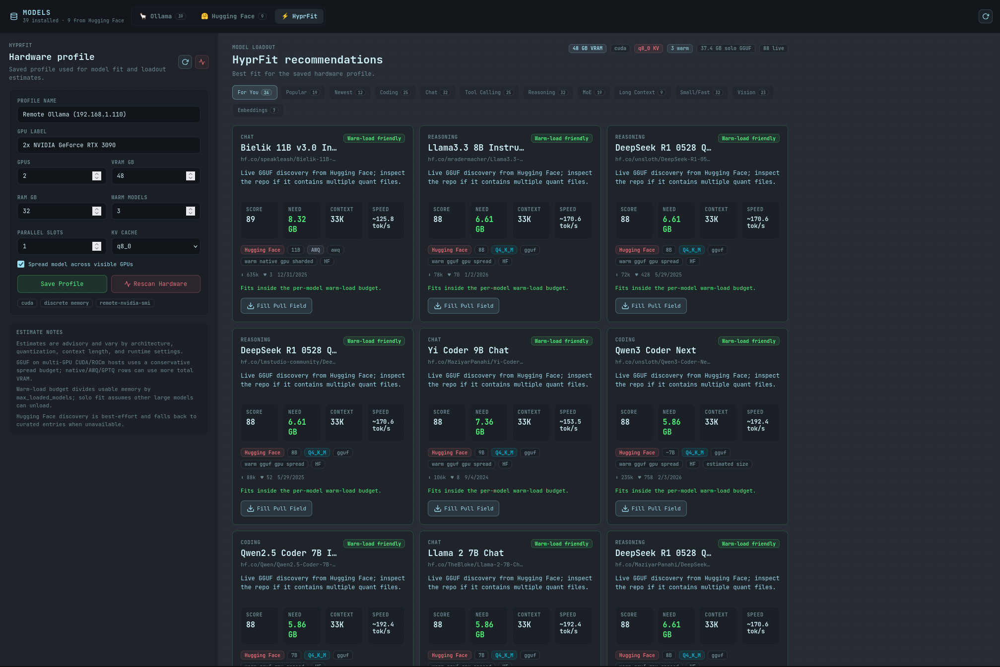
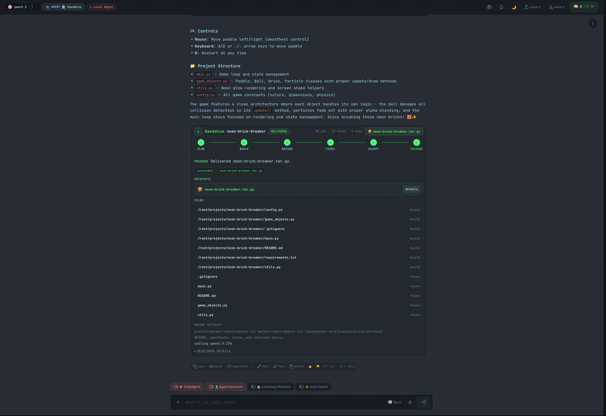
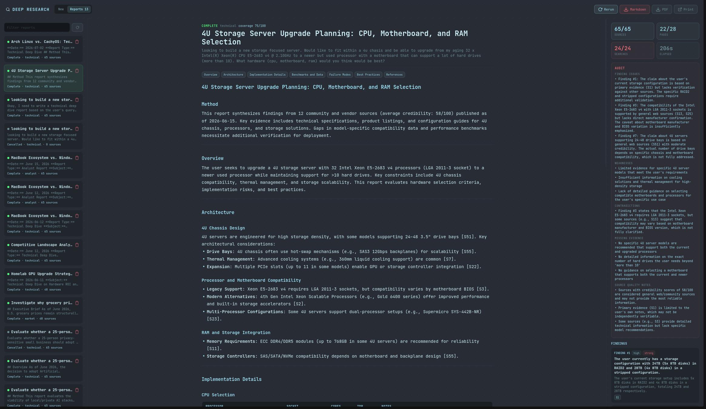
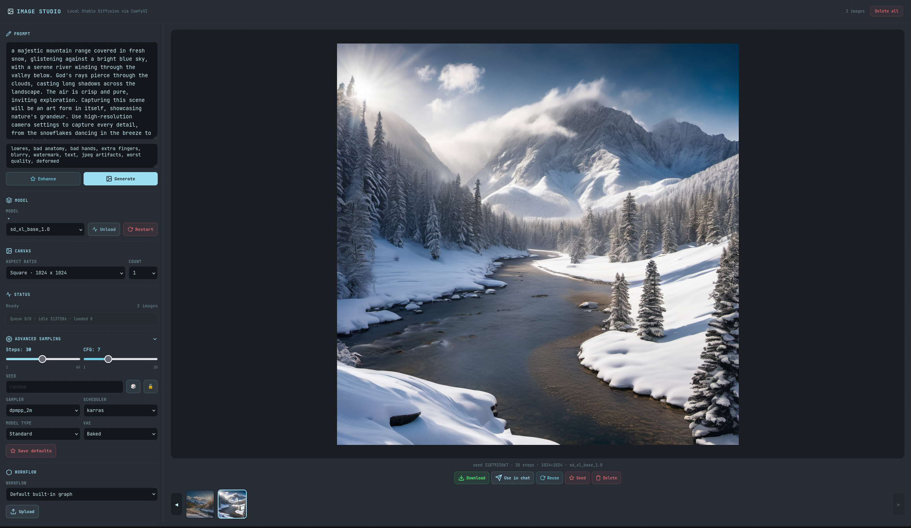
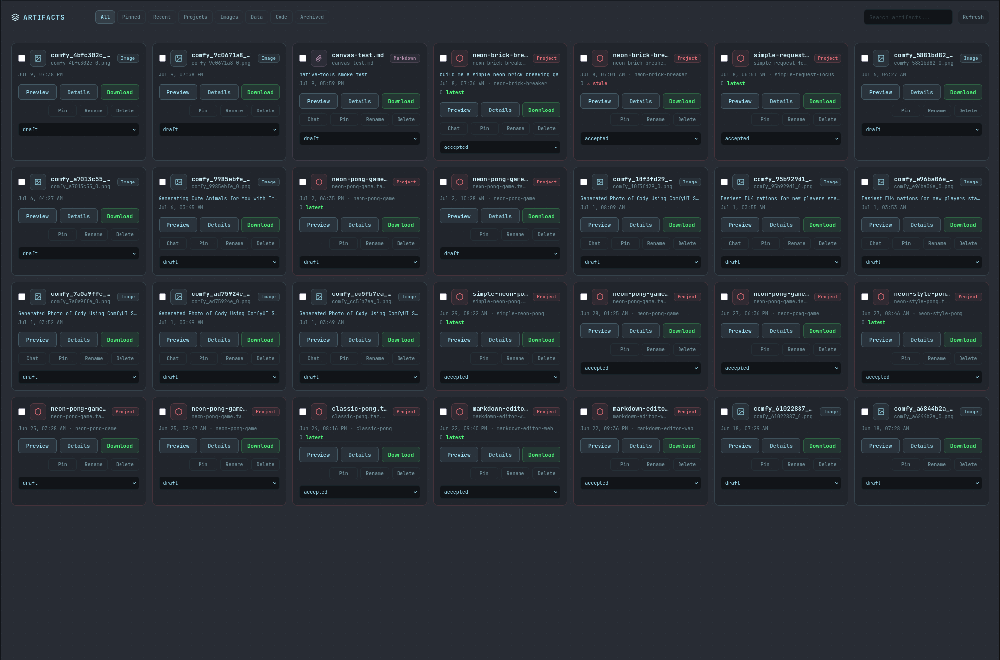

<p align="center">
  
</p>

<h1 align="center">HyprChat</h1>

<p align="center">
  <strong>Self-hosted AI chat platform</strong> — tool calling, Daedalus agentic coding, deep research, image generation, voice, multi-model councils, artifact editing, and full model management. All running on your own hardware.
</p>

<p align="center">
  Built with FastAPI + a Vite-compiled React SPA. Local-first with no required cloud dependencies — optional OpenAI, Anthropic, and any OpenAI-compatible provider via your own API keys.
</p>

<p align="center">
  <code>FastAPI</code> · <code>React 18</code> · <code>Vite</code> · <code>Ollama</code> · <code>SQLite</code> · <code>SearXNG</code> · <code>ComfyUI</code> · <code>Codebox</code> · <code>PWA</code>
</p>

> ⚠️ Alpha software — actively developed, expect rough edges. Check [releases](https://github.com/eefernet/hyprchat/releases) for stable builds.

---

## ⚠️ Security Warning

HyprChat can execute code, upload files, call local services, and drive coding agents. **Do not expose it directly to the public internet.** Run it behind Tailscale, a VPN, or a reverse proxy with authentication. The default configuration binds to `127.0.0.1` and assumes a trusted local network.

---

## What It Is

HyprChat is a local-first replacement for hosted AI chat apps and OpenWebUI-style dashboards. It combines chat, model management, web research, RAG, image generation, voice input/output, agent profiles, project workspaces, an artifact library with a built-in editor, and a coding-agent workflow into one FastAPI service and one Vite-built React app. Install it to your home screen as a PWA and it feels like a native app.

<p align="center">
  
</p>

## Highlights

| Area | What you get |
|---|---|
| 💬 Chat | SSE streaming, Markdown/code rendering, thinking tokens, live tok/s stats, ▶ continue for cut-off replies, 👍/👎 ratings, slash commands, forks, search, tags, exports |
| 🧭 Routing | Optional Auto model — each message is classified locally and routed to the model you configured per category (chat / code / reasoning / long-context) |
| ☁️ Cloud models | OpenAI, Anthropic, and any OpenAI-compatible endpoint (OpenRouter, Groq, vLLM, llama.cpp, LiteLLM) with **native tool calling** and estimated spend tracking |
| 🏛️ Daedalus | Architect → Builder → Reviewer → Acceptance workflow for building and fixing projects, with server-enforced gates |
| 🔎 Research | Quick Search on every turn, deep research reports with a dedicated composer, source cards, durable report history |
| 🧰 Tools | Code execution, shell/file tools, URL fetch, custom Python tools, uploaded project awareness |
| 🎨 Images | Local ComfyUI generation from chat or Image Studio — LoRAs, saved workflows, persona selfies, prompt enhancement |
| 🎙️ Voice | Browser microphone transcription and assistant reply playback through proxied STT/TTS services |
| 🔌 Connectors | MCP servers and OpenAPI specs discovered into chat-usable tools, with credential placeholders and private-URL guards |
| 📚 Knowledge | RAG knowledge bases with hybrid retrieval, inline `[n]` citations, smart reranking, URL ingestion, and scanned-PDF OCR |
| 🧠 Memory | Global user memory, workspace memory with reviewed suggestions, cross-chat history recall, and Ghost Mode for unsaved chats |
| 📁 Artifacts | Artifact Studio tracks delivered files, projects, and images — plus a full-screen Canvas editor with AI-assisted edits |
| 🗳️ Councils | Run multiple models in parallel, debate answers, vote, and synthesize the result |
| 📦 Models | Ollama model browser, HuggingFace GGUF downloads, HyprFit hardware-fit recommendations, capability badges |
| 🧩 Profiles | Agents for tasks, Personas for style/roleplay, per-profile tools and knowledge bases |
| 📱 PWA | Installable web app with offline shell caching, served over HTTPS via Tailscale Serve |
| 💾 Backup | One-click full data backup with secret scrubbing, and staged safe restore |

## Feature Tour

### 💬 Rich Chat

Use HyprChat like a normal chat app, then turn on heavier tools only when needed. Messages stream live with tokens/sec in the header, render structured output inline, and can be forked, searched, tagged, exported, or attached to workspaces.

- **Continue truncated replies** — responses cut off by the output-token limit get a ▶ continue button that resumes the same message in place.
- **Message ratings** — 👍/👎 on assistant replies, persisted per message and totaled in Statistics.
- **Slash commands** — type `/` in the composer to search and insert Prompt Library prompts, with `{{variable}}` placeholders filled via an inline form.
- **Auto-compaction** — optionally summarize older turns into a rolling summary when a long conversation nears its context window, so chats never lose their beginning.
- **Smart model routing** — enable the 🧭 Auto model and each message is classified locally (chat/code/reasoning, plus a deterministic long-context check) and routed to the model you configured per category. The footer shows which model answered.

<p align="center">
  
  
  
  
</p>

### 📦 Models — Local & Cloud

Manage installed Ollama models, browse HuggingFace GGUF files, watch active downloads, and let HyprFit rank pull candidates against your saved or detected hardware profile (including remote Ollama hosts scanned over SSH).

Cloud models sit alongside local ones in the same picker with prefixed IDs:

- **OpenAI & Anthropic** — add API keys in Settings → Connections and the models appear as `openai:<model>` / `anthropic:<model>`.
- **Custom (OpenAI-compatible)** — point HyprChat at any `/chat/completions` endpoint (OpenRouter, Groq, Mistral, vLLM, llama.cpp, LiteLLM) with a base URL, optional key, and display name; models appear as `custom:<model>` with full streaming, thinking, vision, and usage support.
- **Native tool calling** — tools-enabled chats with OpenAI/Claude models send real JSON tool definitions instead of the text-parsing fallback, making multi-step tool use dramatically more reliable. Models that reject tools fall back to the text format automatically.
- **Cost tracking** — estimated cloud spend shows in Statistics with per-model cost columns and today/30-day/all-time totals. Local models are never costed.

HyprFit's hardware-fit ranking model is adapted from the MIT-licensed llmfit/Pewdiepie Odysseus Cookbook approach; see [docs/licenses/llmfit-MIT-LICENSE.txt](docs/licenses/llmfit-MIT-LICENSE.txt).

<p align="center">
  
  
</p>

### 🏛️ Daedalus Agentic Coding

Daedalus is the coding workflow. It plans, builds, reviews, fixes, and acceptance-checks projects instead of sending a single giant prompt and hoping for the best. `plan_project` always uses the structured Architect path, so Builder receives the same manifest plus an advisory interface contract: entrypoint, dependency policy, shared constants, public signatures, and cross-file rules when the Architect can infer them. Workflow progress renders as one unified card with a phase stepper — plan, build, review, fix, acceptance, package — instead of a wall of raw tool output.

<p align="center">
  
</p>

| Agent | Role |
|---|---|
| 📐 Architect | Creates a structured plan, file tree, commands, dependencies, success criteria, and optional interface contract |
| 🏗️ Builder | Uses OpenHands in Codebox for greenfield builds, with scaled rounds and bounded missing-file continuation |
| 🔍 Reviewer | Runs real build/test/lint commands and returns concrete issues |
| 🛠️ Aider Fixer | Applies focused repairs to existing project roots, including uploads and Builder-created projects |
| 🔧 Fixer | Fallback scoped editor when Aider is disabled, unhealthy, or cannot produce a patch |
| ✅ Acceptance | Final gate for request fit, docs, tests, packaging, and generated artifacts |
| ❓ ProjectQA | Answers codebase questions with grounded file references |

Workflow state is enforced server-side, so Daedalus cannot skip review, ship before acceptance, or loop forever on the same blocker. Delivered project archives exclude generated/cache/build outputs plus Aider runtime metadata such as `.aider*`.

### 🧰 Tools & Quick Search

Built-in tools cover code execution, file operations, shell commands, direct URL reading, Quick Search, deep research, and custom uploaded Python tools. Quick Search runs a hybrid planner — instant deterministic queries plus a small-LLM planner in parallel — and adds SearXNG result cards, thumbnails, and web previews directly above the chat turn.

<p align="center">
  
</p>

### 🔎 Deep Research

Deep Research runs multi-step searches, reads pages, cross-checks sources, and writes durable reports you can revisit, export, print, or add to a workspace. Starting a report opens a dedicated full-page composer with report type, model, context, and source settings, and finished reports live in a browsable history.

<p align="center">
  
  
</p>

### 🎨 Image Generation & Image Studio

Generate pictures directly in chat with the `generate_image` tool, or use Image Studio for a full ComfyUI control surface. Chat images render inline, are stored as artifacts, and can use global defaults for checkpoint, workflow, resolution, VAE, prompt prefix, negative prompt, and compose model.

Image Studio supports local Stable Diffusion and Flux-style ComfyUI workflows, checkpoint/VAE selection, LoRAs, seed lock/randomize, slider-based steps/CFG, extra SDXL aspect ratios, sampler and scheduler defaults, model-sampling presets, saved API workflows from JSON or workflow-bearing PNG uploads, prompt enhancement, thumbnail galleries, lightbox preview, artifact reuse, full-trace purge, and ComfyUI memory controls. HyprChat injects v-prediction or flow sampling nodes only when the workflow does not already contain the matching mode, and defers ComfyUI cleanup while any generation or prompt submission is still in flight.

<p align="center">
  
</p>

<p align="center">
  
  
</p>

<p align="center">
  
</p>

### 🎙️ Voice

Voice is optional and local-service friendly. The composer can record from the browser microphone and send audio to HyprChat for speech-to-text, while assistant messages can be read aloud through text-to-speech with per-voice selection and optional auto-play.

The browser only talks to HyprChat. The backend proxies OpenAI-compatible STT and TTS services such as Speaches/Whisper and kokoro-fastapi, which avoids CORS issues and keeps those LAN services off the public browser surface.

### 📁 Artifacts & Canvas Editor

Artifact Studio is the library for everything HyprChat delivers — files, project archives, and generated images — with search and filters, previews, timelines, duplicate merge, revisions, bundles, add-to-KB, send-to-research, use-in-chat, and fork-to-Codebox.

Text-like artifacts (text, markdown, code, JSON, HTML) open in a full-screen **Canvas editor** — syntax-highlighted CodeMirror with a ✏️ Edit button in the detail panel. Select any text and describe a change, and **AI Edit** proposes a rewrite with a before/after diff you can apply or reject. Saving always creates a new revision; originals are never overwritten.

<p align="center">
  
</p>

### 🗳️ Councils

Councils run multiple models against the same prompt, optionally debate across rounds, vote on the best answer, and synthesize the final result. Council members can link to personas, inheriting the persona's model, prompt, and name at runtime, and council chats show address panels, round sections, peer ballots, and moderator verdicts.

<p align="center">
  
</p>

### 📚 Knowledge Bases & Workspaces

Upload documents, attach knowledge bases to profiles, index uploaded code projects, and group related chats into workspaces. Workspaces can analyze topics and generate profile prompts from accumulated context.

KB answers use **hybrid retrieval** (ChromaDB vectors + SQLite FTS5 keywords, fused) and render clickable inline `[n]` citation chips. Recent additions:

- **Add URL** — paste a web page or PDF URL into a KB card; it is fetched SSRF-safely, extracted, stored as markdown with source provenance, and indexed like an upload. Re-adding the same URL updates in place.
- **Smart KB Reranking** — retrieval candidates are re-scored for relevance by a quick local model pass before answering; any error falls back to normal ranking.
- **Scanned-PDF OCR** — PDFs with no text layer (scans, faxes, photographed docs) are OCR'd automatically during KB upload and chat PDF extraction (RapidOCR, CPU-only, up to 50 pages).

<p align="center">
  
  
</p>

### 🧠 Memory & History Recall

Global user memory captures who you are across all chats, while workspace memory collects reviewed suggestions and pinned instruction blocks per project — only memories you accept are ever injected into prompts. Ghost Mode keeps a chat entirely unsaved.

**Chat-history recall** extends memory across conversations: turns from memory-enabled chats are indexed into ChromaDB, a `search_history` tool lets the model answer "what did we decide about X?" from past conversations, and the Memory panel gains a semantic + keyword Search Past Conversations box. Edits re-index and deletes clean up.

### 🧩 Agents & Personas

Agents are task profiles for coding, research, automation, and tool-heavy work. Personas are voice and scenario profiles with their own model, prompt, avatar, tools, knowledge bases, generation settings, and optional image appearance context for in-character photos. Photos sent by the persona are restricted based on their age rating. Yes, you can have nsfw conversations and images sent from your persona 😉.

<p align="center">
  
  
</p>

### 📱 PWA & Mobile Access

HyprChat ships a web app manifest, icons, and a network-first service worker, so it installs to your phone's home screen or desktop dock like a native app. The service worker only keeps the app shell loadable — it never touches API traffic.

Installation requires HTTPS. The reference setup uses **Tailscale Serve** to proxy `https://hyprchat.<tailnet>.ts.net` to the backend with an automatic valid certificate — no cert management, tailnet-only exposure, and it also unlocks the microphone without browser flags.

### ⚙️ Settings, Analytics, Backup

Every settings tab uses one titled-card design system: appearance, generation defaults, chat image defaults, RAG, Daedalus, voice, animated backgrounds, and service connections. Statistics tracks token usage, tokens/sec, estimated cloud spend, message ratings, and service health history, and the activity monitor watches downloads and long-running jobs.

**Backup & Restore** (Settings → Danger Zone) produces a one-click full data backup — a consistent SQLite copy with provider keys and connector secrets scrubbed, plus uploads, knowledge bases, and settings. Restores stage safely and apply on the next service restart, keeping the previous database as a `.pre-restore` copy.

<p align="center">
  
  
</p>

## Architecture

```text
User → HyprChat (:8000)
         ├── Frontend: React SPA, Vite build, installable PWA
         │    (source frontend/src/ → built frontend/dist/)
         ├── Backend: FastAPI + SSE streaming + SQLite
         │    ├── backend.main:app entrypoint + extracted routers in backend/routes/
         │    ├── Chat/tool loop + smart model routing + auto-compaction
         │    ├── Daedalus workflow router
         │    ├── Research + Quick Search
         │    ├── RAG + ChromaDB (hybrid retrieval, reranking, OCR)
         │    ├── MCP/OpenAPI connector tools
         │    ├── Image generation proxy + artifact-backed gallery
         │    ├── Voice STT/TTS proxy
         │    ├── Artifact Studio + Canvas AI edits + global/workspace memory
         │    ├── Backup/restore engine
         │    └── Model, profile, workspace, council APIs
         ├── Ollama (:11434) - local LLM inference
         ├── OpenAI / Anthropic / Custom OpenAI-compatible (optional)
         │    - cloud models via API keys, native tool calling
         ├── Codebox (:8585) - sandboxed execution
         ├── OpenHands Worker (:8586) - OpenHands + Aider bridge
         ├── SearXNG (:8888) - private web search
         ├── ComfyUI (:8188) - local Stable Diffusion / Flux image generation
         ├── Speaches STT (:8001) - OpenAI-compatible speech-to-text
         ├── Kokoro TTS (:8880) - OpenAI-compatible speech synthesis
         └── n8n (:5678) - external automation integration
```

### Important Files

| Path | Purpose |
|---|---|
| `backend/main.py` | FastAPI app setup, lifespan, middleware/static serving, SSE/chat endpoints, and remaining unextracted API groups |
| `backend/routes/` | Extracted FastAPI routers for health, settings/analytics, users, audio, cloud providers, HF, tools/connectors, model configs, Ollama model actions, artifacts, and backup |
| `backend/agents/chat.py` | Streaming chat loop, tool calling, quick search injection, model routing, compaction, project-aware chat |
| `backend/tools.py` | Tool execution, Daedalus routing/gates, OpenHands/Aider dispatch |
| `backend/agents/*.py` | Daedalus agents, personas, reviewer, acceptance, project QA, indexer |
| `backend/database.py` | SQLite schema, migrations, conversations, runs, workflows, reports |
| `backend/model_providers.py` | OpenAI/Anthropic/Custom cloud model adapters, key storage, streaming bridges, price table |
| `backend/provider_tools.py` | Native cloud tool calling — tool definition/message conversion and streamed tool-call parsing |
| `backend/connectors.py` | MCP/OpenAPI connector discovery, credential placeholders, execution guardrails |
| `backend/research.py` | Deep research and safe URL fetch pipeline |
| `backend/quick_search.py` / `backend/search_agent.py` | Per-turn SearXNG search planning, ranking, page fetch, result cards |
| `backend/rag.py` / `backend/reranker.py` / `backend/ocr.py` | Hybrid RAG retrieval, smart KB reranking, scanned-PDF OCR, history recall |
| `backend/comfyui.py` | ComfyUI workflow patching, image generation client, saved workflow library, model defaults, cleanup hooks |
| `backend/voice.py` | Speech-to-text and text-to-speech proxy helpers for OpenAI-compatible local services |
| `backend/canvas_edit.py` | Artifact Canvas AI selection edits |
| `backend/backup.py` | Backup archive build, secret scrubbing, staged restore |
| `frontend/src/main.jsx` | React root app, root state, and chat flow |
| `frontend/src/session.js`, `theme.js`, `modelHelpers.js` | Extracted API/session, theme, and model/render helper modules |
| `frontend/src/ModelPicker.jsx`, `frontend/src/components/`, `frontend/src/panels/` | Extracted model picker, leaf widgets/render blocks, Artifact/Image Studio panels, Canvas editor, Analytics, and Prompt Library UI |
| `frontend/public/` | PWA manifest, icons, and network-first service worker |
| `deploy_monitor.py` | File watcher that deploys local changes to the homelab host |

## Fresh Install

HyprChat expects Python 3.11+, Ollama, and at least one pulled model. Codebox, OpenHands, SearXNG, ComfyUI, Speaches/Whisper, Kokoro TTS, and n8n are optional but unlock the heavier workflows.

### Track A: Local Dev Clone

Use this when you are running directly from a checkout. Backend storage defaults to repo-local `./data`, so a fresh clone does not need write access to `/opt/hyprchat`.

```bash
git clone <repo-url> hyprchat
cd hyprchat

( cd frontend && npm install && npm run build )
python3 -m pip install -r backend/requirements.txt

( cd backend && HOST=127.0.0.1 PORT=8000 python3 main.py )
```

Open `http://127.0.0.1:8000`.

Override storage with `HYPRCHAT_DATA_DIR=/path/to/data` or the individual `DATABASE_PATH`, `UPLOAD_DIR`, `KB_DIR`, `TOOLS_DIR`, `SANDBOX_DIR`, `SETTINGS_PATH`, and `CONNECTOR_SECRETS_PATH` variables when needed.

### Track B: Server Install (`/opt/hyprchat`)

Use this for a service install on a VM/LXC/bare-metal server. The systemd unit uses `/opt/hyprchat/.env`, and `scripts/deploy.sh` creates that file from `.env.example` if it is missing.

```bash
# Build the frontend before deploy. frontend/dist/ is generated and not committed.
( cd frontend && npm install && npm run build )

# Copy or clone the project to /opt/hyprchat, including frontend/dist/.
cd /opt/hyprchat
sudo bash scripts/deploy.sh
```

The deploy script verifies required files, creates the `hyprchat` system user/group, creates `/opt/hyprchat/data`, seeds `/opt/hyprchat/.env`, fixes ownership, installs Python dependencies, installs the systemd unit, and starts the service. The service runs one Uvicorn worker by default; keep that unless you have reviewed SQLite write behavior.

The Proxmox scripts in `scripts/create-lxc.sh` and `scripts/create-comfyui-lxc.sh` are homelab helpers for this repo's reference setup. They are not required for a normal VM or bare-metal install.

## Configuration

Most settings can be changed in the app. Environment variables are still useful for first boot and service defaults:

```bash
HOST=127.0.0.1
PORT=8000
OLLAMA_URL=http://127.0.0.1:11434
CODEBOX_URL=http://127.0.0.1:8585
OPENHANDS_URL=http://127.0.0.1:8586
SEARXNG_URL=http://127.0.0.1:8888
COMFYUI_URL=
COMFYUI_WORKFLOW_PATH=
STT_URL=
STT_MODEL=Systran/faster-distil-whisper-large-v3
TTS_URL=
TTS_VOICE=af_heart
HYPRCHAT_OUTBOUND_PROXY=

# Storage. These are server-install defaults; local dev can omit them.
# To use HYPRCHAT_DATA_DIR as one custom base directory, remove/comment the
# specific path overrides below.
DATABASE_PATH=/opt/hyprchat/data/hyprchat.db
UPLOAD_DIR=/opt/hyprchat/data/uploads
TOOLS_DIR=/opt/hyprchat/data/tools
KB_DIR=/opt/hyprchat/data/knowledge_bases
SANDBOX_DIR=/opt/hyprchat/data/sandbox
SETTINGS_PATH=/opt/hyprchat/data/settings.json
CONNECTOR_SECRETS_PATH=/opt/hyprchat/data/connector_secrets.json

IMAGE_CHAT_CHECKPOINT=
IMAGE_CHAT_WORKFLOW=
IMAGE_CHAT_RESOLUTION=1024x1024
IMAGE_CHAT_VAE=
IMAGE_CHAT_PROMPT_PREFIX=
IMAGE_CHAT_NEGATIVE=
IMAGE_CHAT_COMPOSE_MODEL=

DEFAULT_MODEL=qwen3.5:27b
PLANNING_MODEL=qwen3.5:27b
CODER_MODEL=qwen2.5-coder:14b

# Optional cloud model providers (or save keys per user in Settings → Connections)
OPENAI_API_KEY=
ANTHROPIC_API_KEY=
```

`HYPRCHAT_OUTBOUND_PROXY` is optional. The first-time deploy monitor can set it
to `http://<searxng-host>:8899` after the SearXNG privacy setup verifies that a
Proton OpenVPN tunnel and host-local proxy are active.

Scanned-PDF OCR needs two optional packages on the server:
`python3 -m pip install rapidocr-onnxruntime pypdfium2`. Without them, OCR is
silently skipped and text-layer PDFs still work normally.

Runtime settings live in the Settings overlay. Source defaults live in `backend/config.py`.

## Optional Image Generation

HyprChat boots cleanly without ComfyUI. When `COMFYUI_URL` is empty and no ComfyUI URL has been saved in Settings, Image Studio and chat `generate_image` are disabled rather than fatal.

For setup details, see [Image Generation Setup](docs/image-generation-setup.md). It covers connecting an existing ComfyUI, the Proxmox companion LXC helper, the required checkpoint/default workflow expectations, the optional HyprChat ComfyUI control node, and the journal scrub helper used by full image-trace purge.

## Deployment

For this homelab setup, `deploy_monitor.py` is the fastest edit/deploy loop:

```bash
python3 deploy_monitor.py
```

It reads `.deploy_config.json`, pushes changed backend/frontend files, restarts HyprChat after backend changes, and deploys `backend/openhands_worker.py` to Codebox when needed. The monitor watches the extracted backend route/db/tooling modules and the extracted frontend source modules, and rebuilds + ships the whole `dist/` on frontend changes.

Optional `.deploy_config.json` SearXNG entry:

```json
{
  "hyprchat": {"host": "192.168.1.120", "user": "root", "password": "<local-only-password>"},
  "codebox": {"host": "192.168.1.201", "user": "root", "password": "<local-only-password>"},
  "searxng": {
    "host": "192.168.1.141",
    "user": "root",
    "password": "<local-only-password>",
    "dev_ip": "<optional-dev-ip>"
  }
}
```

On first-time full deploy, a configured `searxng` host runs
`scripts/setup-searxng-privacy.sh`. The script hardens an existing SearXNG
install; it does not install SearXNG or create Proton credentials. To activate
the VPN-backed proxy, place Proton OpenVPN files at
`/etc/openvpn/proton-ovpn/*.ovpn` and credentials at
`/etc/openvpn/proton-ovpn/auth.txt` on the SearXNG host before running setup. If
those files are absent, deploy continues with a warning and does not set
`HYPRCHAT_OUTBOUND_PROXY`.

Manual deploy:

```bash
scp backend/*.py root@<SERVER_IP>:/opt/hyprchat/backend/
scp backend/agents/*.py root@<SERVER_IP>:/opt/hyprchat/backend/agents/
scp backend/routes/*.py root@<SERVER_IP>:/opt/hyprchat/backend/routes/
scp backend/db/*.py root@<SERVER_IP>:/opt/hyprchat/backend/db/
scp backend/tooling/*.py root@<SERVER_IP>:/opt/hyprchat/backend/tooling/

# Frontend: build on the dev machine, then ship the WHOLE dist/ (the hashed
# asset names change every build, so clear the old ones first).
( cd frontend && npm run build )
ssh root@<SERVER_IP> "rm -rf /opt/hyprchat/frontend/dist/assets"
scp -r frontend/dist/. root@<SERVER_IP>:/opt/hyprchat/frontend/dist/

ssh root@<SERVER_IP> "systemctl restart hyprchat"
```

## Operations

```bash
journalctl -u hyprchat -f
systemctl restart hyprchat
systemctl status hyprchat
curl -s http://127.0.0.1:8000/api/health
```

If you bind HyprChat to a private Tailscale IP, use that IP for health checks and tests. For HTTPS + PWA install, enable Tailscale Serve on the host:

```bash
tailscale serve --bg http://<hyprchat-bind-ip>:8000
tailscale serve status
```

## Post-Install Verification

Run these against the interface where HyprChat is actually listening:

```bash
curl -s http://127.0.0.1:8000/api/health | python3 -m json.tool
curl -s http://127.0.0.1:8000/api/models | python3 -m json.tool
curl -s http://127.0.0.1:8000/api/images/checkpoints | python3 -m json.tool
curl -s -X POST http://127.0.0.1:8000/api/images/enhance-prompt \
  -H 'Content-Type: application/json' \
  -d '{"prompt":"a small cabin at dusk"}' | python3 -m json.tool
```

`/api/images/checkpoints` returns `503` until ComfyUI is configured; after image setup it should return a checkpoint list. Prompt enhancement requires a reachable model provider. Finish the media check in the UI by running one Image Studio generation and one chat request that calls `generate_image`.

## Testing

Fast syntax check:

```bash
python3 -m py_compile backend/*.py backend/agents/*.py backend/routes/*.py backend/db/*.py backend/tooling/*.py
```

Integration tests expect a live HyprChat instance:

```bash
cd backend
python3 -m pip install -r requirements.txt pytest
HYPRCHAT_URL=http://127.0.0.1:8000 python3 -m pytest tests/ -v
```

Daedalus research/fixer hardening coverage requires `aiosqlite` from
`backend/requirements.txt`; `backend/tests/test_agent_research_hardening.py`
is a required CI check and will skip in incomplete local test environments.

## Stack

| Layer | Tech |
|---|---|
| Backend | Python 3.11+, FastAPI, httpx, aiosqlite |
| Frontend | React 18, Vite build with npm-bundled libs; installable PWA with a network-first service worker |
| Database | SQLite + ChromaDB |
| LLM Runtime | Ollama with native tool calling plus text fallback; optional OpenAI/Anthropic/custom cloud models with native provider tool calling |
| Search | SearXNG |
| Image Generation | ComfyUI through backend-proxied Image Studio and chat `generate_image` |
| Voice | OpenAI-compatible STT/TTS services proxied through HyprChat, e.g. Speaches and Kokoro |
| Coding Sandbox | Codebox LXC + OpenHands + Aider |
| Automation | External n8n integration |

## Project Notes

- The frontend is a Vite app. Build on the dev machine (`cd frontend && npm run build`); the server just serves `frontend/dist/` and stays Node-free.
- SQLite is the default database.
- Tool-call fallback stays because not every Ollama model supports native tools.
- Keep secrets out of Git: `.deploy_config.json`, `.env*`, keys, tokens, databases, and uploaded data.
