<p align="center">
  
</p>

<h1 align="center">HyprChat</h1>

<p align="center">
  <strong>Self-hosted AI chat platform</strong> — tool calling, Daedalus agentic coding, deep research, image generation, voice, multi-model councils, n8n automation integration, and full model management. All running on your own hardware.
</p>

<p align="center">
  Built with FastAPI + a single-file React SPA compiled with Vite. Local-first with no required cloud dependencies — optional OpenAI/Anthropic models via your own API keys.
</p>

<p align="center">
  <code>FastAPI</code> · <code>React 18</code> · <code>Vite</code> · <code>Ollama</code> · <code>SQLite</code> · <code>SearXNG</code> · <code>ComfyUI</code> · <code>Codebox</code>
</p>

> ⚠️ Alpha software — actively developed, expect rough edges. Check [releases](https://github.com/eefernet/hyprchat/releases) for stable builds.

---

## ⚠️ Security Warning

HyprChat can execute code, upload files, call local services, and drive coding agents. **Do not expose it directly to the public internet.** Run it behind Tailscale, a VPN, or a reverse proxy with authentication. The default configuration binds to `127.0.0.1` and assumes a trusted local network.

---

## What It Is

HyprChat is a local-first replacement for hosted AI chat apps and OpenWebUI-style dashboards. It combines normal chat, model management, web research, RAG, image generation, voice input/output, agent profiles, project workspaces, and a coding-agent workflow into one FastAPI service and one Vite-built React component file.

<p align="center">
  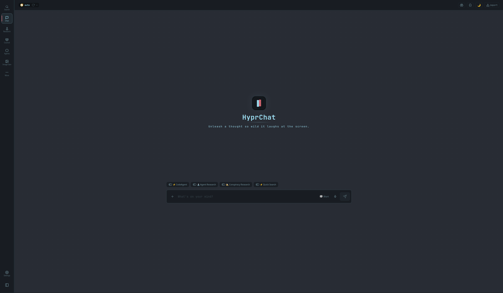
</p>

## Highlights

| Area | What you get |
|---|---|
| 💬 Chat | SSE streaming, Markdown/code rendering, thinking tokens, forks, search, tags, exports, per-chat model controls |
| 🏛️ Daedalus | Architect → Builder → Reviewer → Acceptance workflow for building and fixing projects |
| 🔎 Research | Quick Search, deep research reports, source cards, page reading, durable report history |
| 🧰 Tools | Code execution, shell/file tools, URL fetch, custom Python tools, uploaded project awareness |
| 🎨 Images | Local ComfyUI image generation from chat or Image Studio, saved workflows, persona selfies, prompt enhancement |
| 🎙️ Voice | Browser microphone transcription and assistant reply playback through proxied STT/TTS services |
| 🔌 Connectors | MCP servers and OpenAPI specs discovered into chat-usable tools, with credential placeholders and private-URL guards |
| 📚 Knowledge | RAG knowledge bases, ChromaDB retrieval, workspace memory, project indexing |
| 🧠 Memory | Global user memory plus workspace memory with reviewed suggestions, pinned blocks, and Ghost Mode for unsaved chats |
| 📁 Artifacts | Artifact Studio tracks delivered files, projects, and generated images with previews, versions, revisions, bundles, and timelines |
| 🗳️ Councils | Run multiple models in parallel, debate answers, vote, and synthesize the result |
| 📦 Models | Ollama model browser, HuggingFace GGUF search/downloads, HyprFit hardware-fit recommendations, capability badges, optional OpenAI/Anthropic cloud models |
| 🧩 Profiles | Agents for tasks, Personas for style/roleplay, per-profile tools and knowledge bases |

## Feature Tour

### 💬 Rich Chat

Use HyprChat like a normal chat app, then turn on heavier tools only when needed. Messages stream live, can render structured output inline, and can be forked, searched, tagged, exported, or attached to workspaces.

<p align="center">
  
  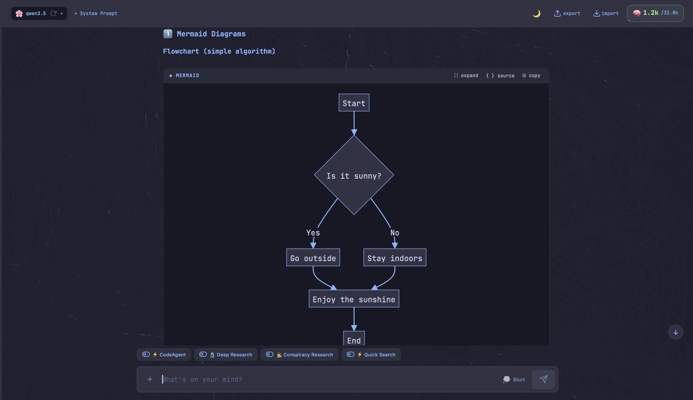
  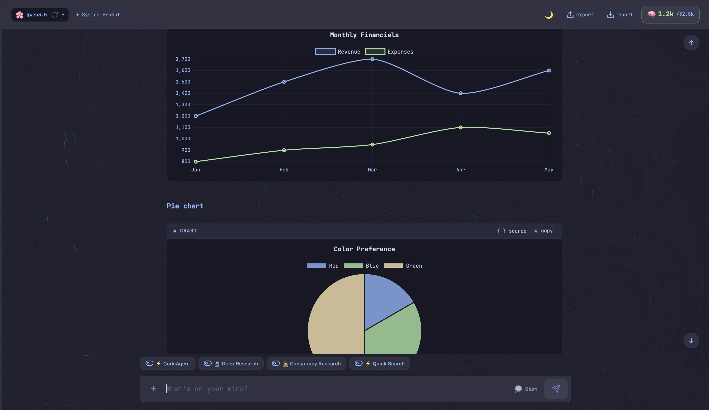
  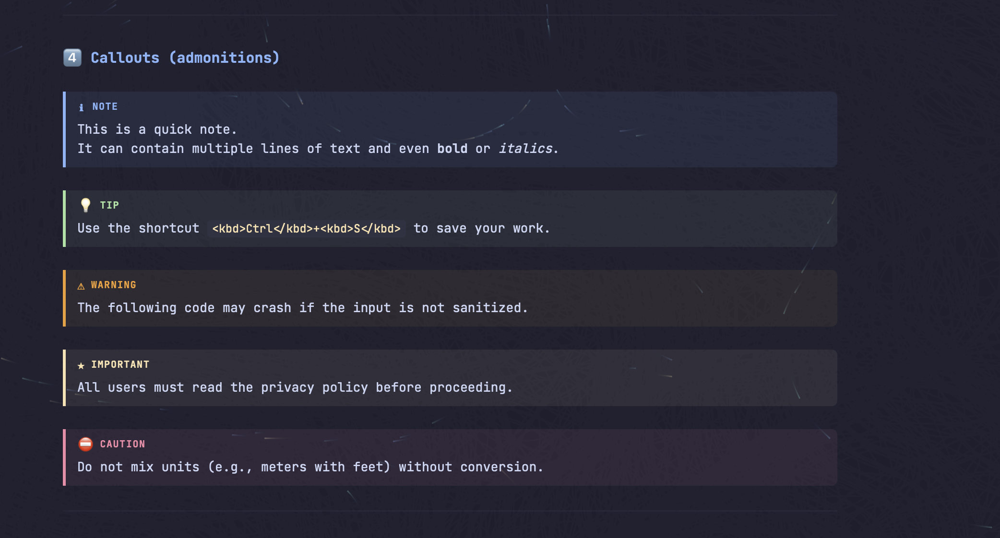
</p>

### 🎨 Image Generation & Image Studio

Generate pictures directly in chat with the `generate_image` tool, or use Image Studio for a full ComfyUI control surface. Chat images render inline, are stored as artifacts, and can use global defaults for checkpoint, workflow, resolution, VAE, prompt prefix, negative prompt, and compose model.

Image Studio supports local Stable Diffusion and Flux-style ComfyUI workflows, checkpoint/VAE selection, sampler and scheduler defaults, model-sampling presets, saved API workflows from JSON or workflow-bearing PNG uploads, prompt enhancement, thumbnail galleries, lightbox preview, artifact reuse, full-trace purge, and ComfyUI memory controls. HyprChat injects v-prediction or flow sampling nodes only when the workflow does not already contain the matching mode, and defers ComfyUI cleanup while any generation or prompt submission is still in flight.

<p align="center">
  
</p>

<p align="center">
  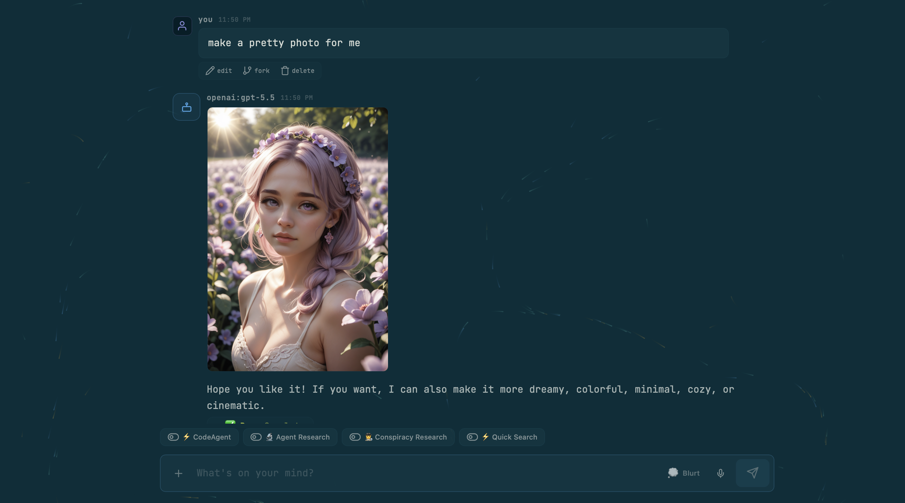
  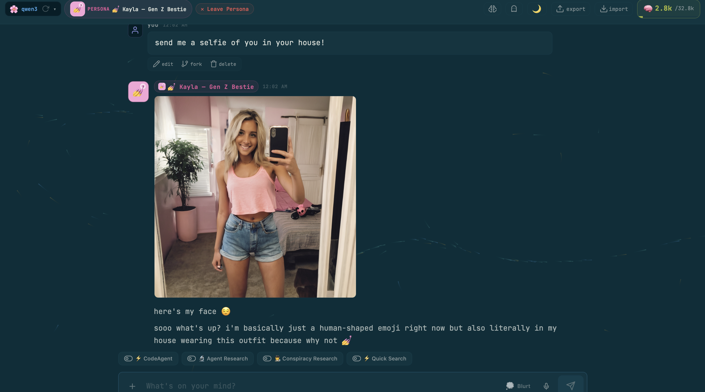
</p>

<p align="center">
  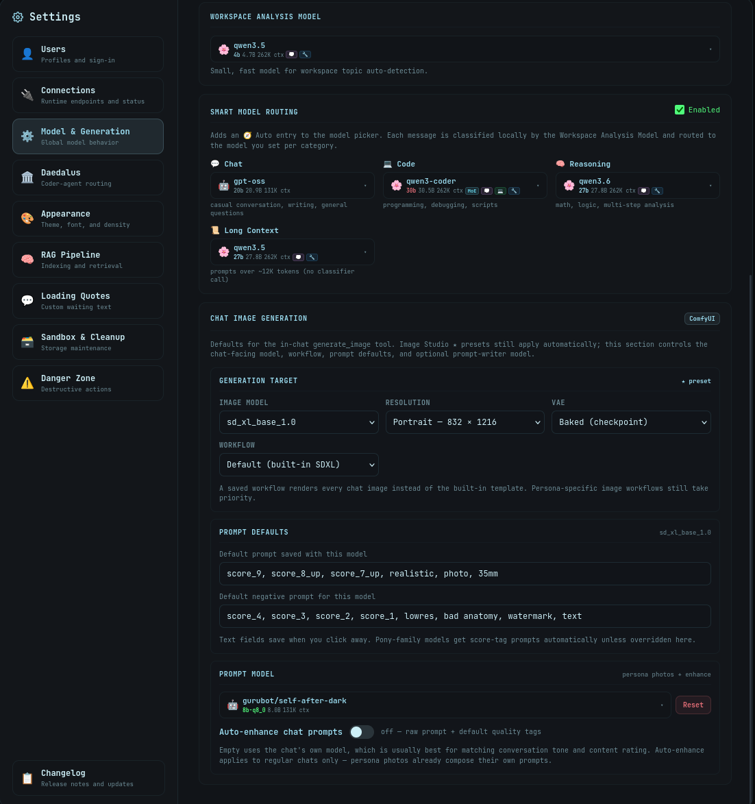
</p>

### 🎙️ Voice

Voice is optional and local-service friendly. The composer can record from the browser microphone and send audio to HyprChat for speech-to-text, while assistant messages can be read aloud through text-to-speech with per-voice selection and optional auto-play.

The browser only talks to HyprChat. The backend proxies OpenAI-compatible STT and TTS services such as Speaches/Whisper and kokoro-fastapi, which avoids CORS issues and keeps those LAN services off the public browser surface.

### 🏛️ Daedalus Agentic Coding

Daedalus is the coding workflow. It plans, builds, reviews, fixes, and acceptance-checks projects instead of sending a single giant prompt and hoping for the best. `plan_project` always uses the structured Architect path, so Builder and Reviewer receive the same manifest contract across coding profiles.

<p align="center">
  
  
</p>

| Agent | Role |
|---|---|
| 📐 Architect | Creates a structured plan, file tree, commands, dependencies, and success criteria |
| 🏗️ Builder | Uses OpenHands in Codebox for greenfield builds |
| 🔍 Reviewer | Runs real build/test/lint commands and returns concrete issues |
| 🛠️ Aider Fixer | Applies focused edits to uploaded projects from the active project root |
| ✅ Acceptance | Final gate for request fit, docs, tests, packaging, and generated artifacts |
| ❓ ProjectQA | Answers codebase questions with grounded file references |

Workflow state is enforced server-side, so Daedalus cannot skip review, ship before acceptance, or loop forever on the same blocker.

### 🧰 Tools & Quick Search

Built-in tools cover code execution, file operations, shell commands, direct URL reading, Quick Search, deep research, and custom uploaded Python tools. Quick Search can add SearXNG result cards, thumbnails, and web previews directly above the chat turn.

<p align="center">
  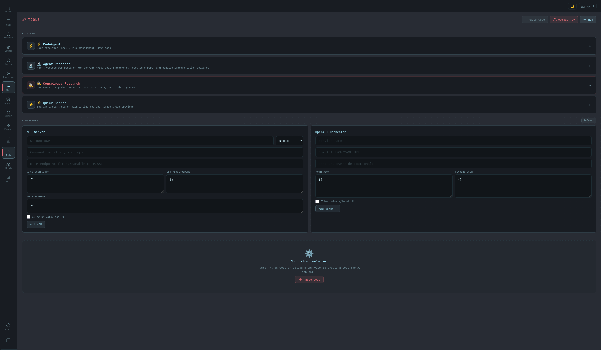
</p>

### 🔎 Deep Research

Deep Research runs multi-step searches, reads pages, cross-checks sources, and writes durable reports you can revisit, export, print, or add to a workspace.

<p align="center">
  
</p>

### 🗳️ Councils

Councils run multiple models against the same prompt, optionally debate across rounds, vote on the best answer, and synthesize the final result.

<p align="center">
  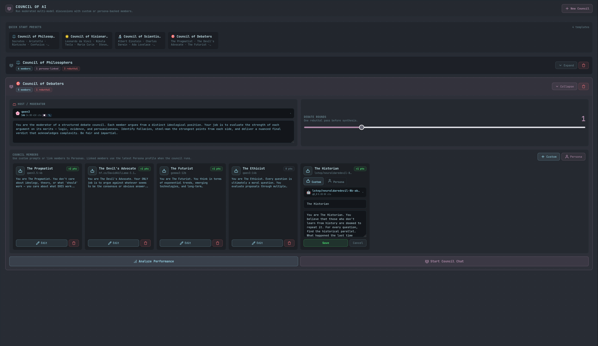
  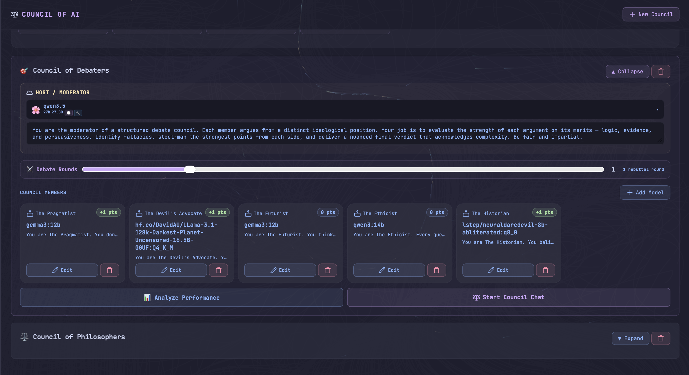
</p>

### 📚 Knowledge Bases & Workspaces

Upload documents, attach knowledge bases to profiles, index uploaded code projects, and group related chats into workspaces. Workspaces can analyze topics and generate profile prompts from accumulated context.

<p align="center">
  
  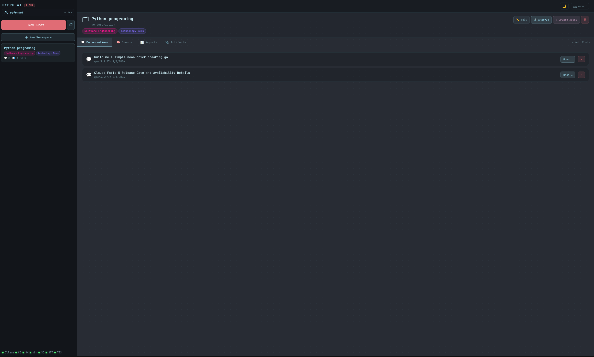
</p>

### 🧩 Agents & Personas

Agents are task profiles for coding, research, automation, and tool-heavy work. Personas are voice and scenario profiles with their own model, prompt, avatar, tools, knowledge bases, generation settings, and optional image appearance context for in-character photos. Photos sent by the persona are restricted based on their age rating. Yes, you can have nsfw conversations and images sent from your persona 😉.

<p align="center">
  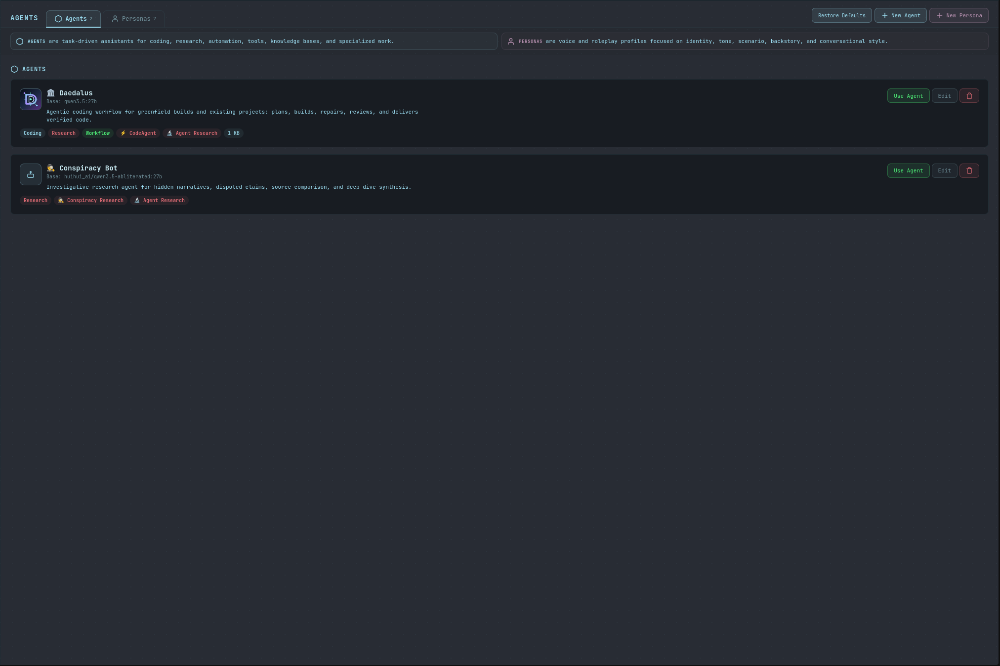
  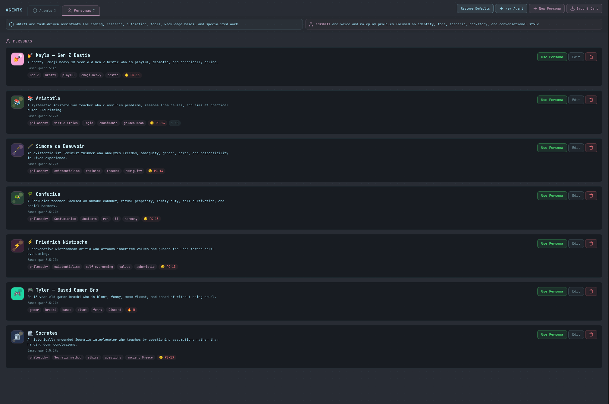
</p>

### 📦 Models, Activity, Settings

Manage installed Ollama models, browse HuggingFace GGUF files, use HyprFit to rank pull candidates against the saved or detected hardware profile, watch active downloads and long jobs, and tune appearance, generation, chat image defaults, RAG, Daedalus, voice, and service connections from the Settings overlay. Optional OpenAI and Anthropic API keys (Settings → Connections) add cloud models alongside local Ollama models in the picker.

HyprFit's hardware-fit ranking model is adapted from the MIT-licensed llmfit/Pewdiepie Odysseus Cookbook approach; see [docs/licenses/llmfit-MIT-LICENSE.txt](docs/licenses/llmfit-MIT-LICENSE.txt).

<p align="center">
  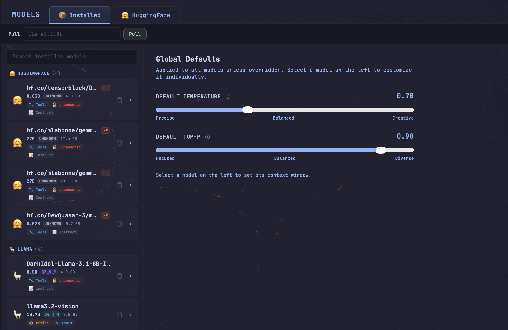
  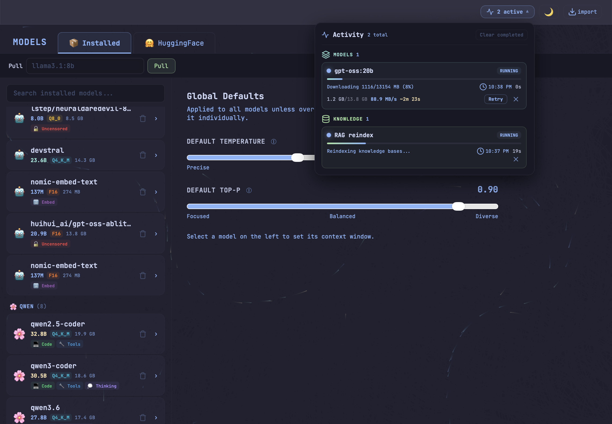
</p>

<p align="center">
  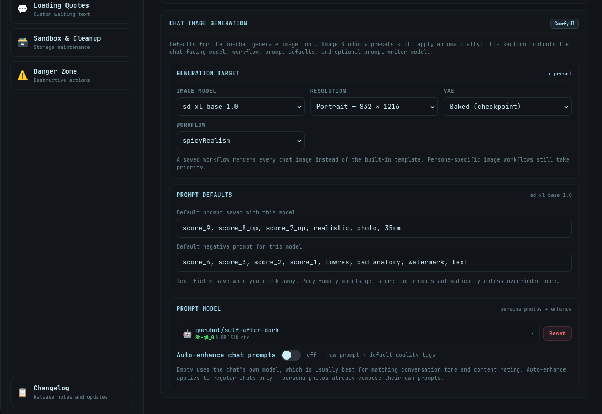
</p>

## Architecture

```text
User → HyprChat (:8000)
         ├── Frontend: single-component React SPA, Vite build
         │    (source frontend/src/main.jsx → built frontend/dist/)
         ├── Backend: FastAPI + SSE streaming + SQLite
         │    ├── Chat/tool loop
         │    ├── Daedalus workflow router
         │    ├── Research + Quick Search
         │    ├── RAG + ChromaDB
         │    ├── MCP/OpenAPI connector tools
         │    ├── Image generation proxy + artifact-backed gallery
         │    ├── Voice STT/TTS proxy
         │    ├── Artifact Studio + global/workspace memory
         │    └── Model, profile, workspace, council APIs
         ├── Ollama (:11434) - local LLM inference
         ├── OpenAI / Anthropic (optional) - cloud models via API keys
         ├── Codebox (:8585) - sandboxed execution
         ├── OpenHands Worker (:8586) - OpenHands + Aider bridge
         ├── SearXNG (:8888) - private web search
         ├── ComfyUI (:8188) - local Stable Diffusion / Flux image generation
         ├── Speaches STT (:8001) - OpenAI-compatible speech-to-text
         ├── Kokoro TTS (:8880) - OpenAI-compatible speech synthesis
         └── n8n (:5678) - external automation integration
```

### Important Files

| Path | Purpose |
|---|---|
| `backend/main.py` | FastAPI routes, SSE endpoints, frontend serving, model/workflow/settings APIs |
| `backend/agents/chat.py` | Streaming chat loop, tool calling, quick search injection, project-aware chat |
| `backend/tools.py` | Tool execution, Daedalus routing/gates, OpenHands/Aider dispatch |
| `backend/agents/*.py` | Daedalus agents, personas, reviewer, acceptance, project QA, indexer |
| `backend/database.py` | SQLite schema, migrations, conversations, runs, workflows, reports |
| `backend/model_providers.py` | Optional OpenAI/Anthropic cloud model adapters, key storage, streaming bridges |
| `backend/connectors.py` | MCP/OpenAPI connector discovery, credential placeholders, execution guardrails |
| `backend/research.py` | Deep research and safe URL fetch pipeline |
| `backend/quick_search.py` / `backend/search_agent.py` | Per-turn SearXNG search planning, ranking, page fetch, result cards |
| `backend/comfyui.py` | ComfyUI workflow patching, image generation client, saved workflow library, model defaults, cleanup hooks |
| `backend/voice.py` | Speech-to-text and text-to-speech proxy helpers for OpenAI-compatible local services |
| `frontend/src/main.jsx` | The entire React frontend (Vite-built to `frontend/dist/`, which the backend serves) |
| `deploy_monitor.py` | File watcher that deploys local changes to the homelab host |

## Quick Start

HyprChat expects Python 3.11+, Ollama, and at least one pulled model. Codebox, OpenHands, SearXNG, ComfyUI, Speaches/Whisper, Kokoro TTS, and n8n are optional but unlock the heavier workflows.

### Local Run

```bash
# Build the frontend first (requires Node.js + npm; dist/ is not committed)
cd frontend
npm install
npm run build
cd ..

cd backend
python3 -m pip install -r requirements.txt
HOST=127.0.0.1 PORT=8000 python3 main.py
```

Open `http://127.0.0.1:8000`.

### LXC / Server Install

Run as root inside the target container after copying or cloning this repo to `/opt/hyprchat`:

```bash
cd /opt/hyprchat
bash scripts/deploy.sh
```

The service runs one Uvicorn worker by default. Keep that unless you have reviewed SQLite write behavior.

## Configuration

Most settings can be changed in the app. Environment variables are still useful for first boot and service defaults:

```bash
HOST=127.0.0.1
PORT=8000
OLLAMA_URL=http://127.0.0.1:11434
CODEBOX_URL=http://127.0.0.1:8585
OPENHANDS_URL=http://127.0.0.1:8586
SEARXNG_URL=http://127.0.0.1:8888
COMFYUI_URL=
COMFYUI_WORKFLOW_PATH=
STT_URL=
STT_MODEL=Systran/faster-distil-whisper-large-v3
TTS_URL=
TTS_VOICE=af_heart
HYPRCHAT_OUTBOUND_PROXY=

IMAGE_CHAT_CHECKPOINT=
IMAGE_CHAT_WORKFLOW=
IMAGE_CHAT_RESOLUTION=1024x1024
IMAGE_CHAT_VAE=
IMAGE_CHAT_PROMPT_PREFIX=
IMAGE_CHAT_NEGATIVE=
IMAGE_CHAT_COMPOSE_MODEL=

DEFAULT_MODEL=qwen3.5:27b
PLANNING_MODEL=qwen3.5:27b
CODER_MODEL=qwen2.5-coder:14b

# Optional cloud model providers (or save keys per user in Settings → Connections)
OPENAI_API_KEY=
ANTHROPIC_API_KEY=
```

`HYPRCHAT_OUTBOUND_PROXY` is optional. The first-time deploy monitor can set it
to `http://<searxng-host>:8899` after the SearXNG privacy setup verifies that a
Proton OpenVPN tunnel and host-local proxy are active.

Runtime settings live in the Settings overlay. Source defaults live in `backend/config.py`.

## Deployment

For this homelab setup, `deploy_monitor.py` is the fastest edit/deploy loop:

```bash
python3 deploy_monitor.py
```

It reads `.deploy_config.json`, pushes changed backend/frontend files, restarts HyprChat after backend changes, and deploys `backend/openhands_worker.py` to Codebox when needed.

Optional `.deploy_config.json` SearXNG entry:

```json
{
  "hyprchat": {"host": "192.168.1.120", "user": "root", "password": "<local-only-password>"},
  "codebox": {"host": "192.168.1.201", "user": "root", "password": "<local-only-password>"},
  "searxng": {
    "host": "192.168.1.141",
    "user": "root",
    "password": "<local-only-password>",
    "dev_ip": "<optional-dev-ip>"
  }
}
```

On first-time full deploy, a configured `searxng` host runs
`scripts/setup-searxng-privacy.sh`. The script hardens an existing SearXNG
install; it does not install SearXNG or create Proton credentials. To activate
the VPN-backed proxy, place Proton OpenVPN files at
`/etc/openvpn/proton-ovpn/*.ovpn` and credentials at
`/etc/openvpn/proton-ovpn/auth.txt` on the SearXNG host before running setup. If
those files are absent, deploy continues with a warning and does not set
`HYPRCHAT_OUTBOUND_PROXY`.

Manual deploy:

```bash
scp backend/*.py root@<SERVER_IP>:/opt/hyprchat/backend/
scp backend/agents/*.py root@<SERVER_IP>:/opt/hyprchat/backend/agents/

# Frontend: build on the dev machine, then ship the WHOLE dist/ (the hashed
# asset names change every build, so clear the old ones first).
( cd frontend && npm run build )
ssh root@<SERVER_IP> "rm -rf /opt/hyprchat/frontend/dist/assets"
scp -r frontend/dist/. root@<SERVER_IP>:/opt/hyprchat/frontend/dist/

ssh root@<SERVER_IP> "systemctl restart hyprchat"
```

## Operations

```bash
journalctl -u hyprchat -f
systemctl restart hyprchat
systemctl status hyprchat
curl -s http://127.0.0.1:8000/api/health
```

If you bind HyprChat to a private Tailscale IP, use that IP for health checks and tests.

## Testing

Fast syntax check:

```bash
python3 -m py_compile backend/*.py backend/agents/*.py
```

Integration tests expect a live HyprChat instance:

```bash
cd backend
python3 -m pip install pytest httpx
HYPRCHAT_URL=http://127.0.0.1:8000 python3 -m pytest tests/ -v
```

## Stack

| Layer | Tech |
|---|---|
| Backend | Python 3.11+, FastAPI, httpx, aiosqlite |
| Frontend | React 18, single component file (`frontend/src/main.jsx`), Vite build with npm-bundled libs |
| Database | SQLite + ChromaDB |
| LLM Runtime | Ollama with native tool calling plus text fallback; optional OpenAI/Anthropic cloud models |
| Search | SearXNG |
| Image Generation | ComfyUI through backend-proxied Image Studio and chat `generate_image` |
| Voice | OpenAI-compatible STT/TTS services proxied through HyprChat, e.g. Speaches and Kokoro |
| Coding Sandbox | Codebox LXC + OpenHands + Aider |
| Automation | External n8n integration |

## Project Notes

- The frontend is one large component file built with Vite. Build on the dev machine (`cd frontend && npm run build`); the server just serves `frontend/dist/` and stays Node-free.
- SQLite is the default database.
- Tool-call fallback stays because not every Ollama model supports native tools.
- Keep secrets out of Git: `.deploy_config.json`, `.env*`, keys, tokens, databases, and uploaded data.
