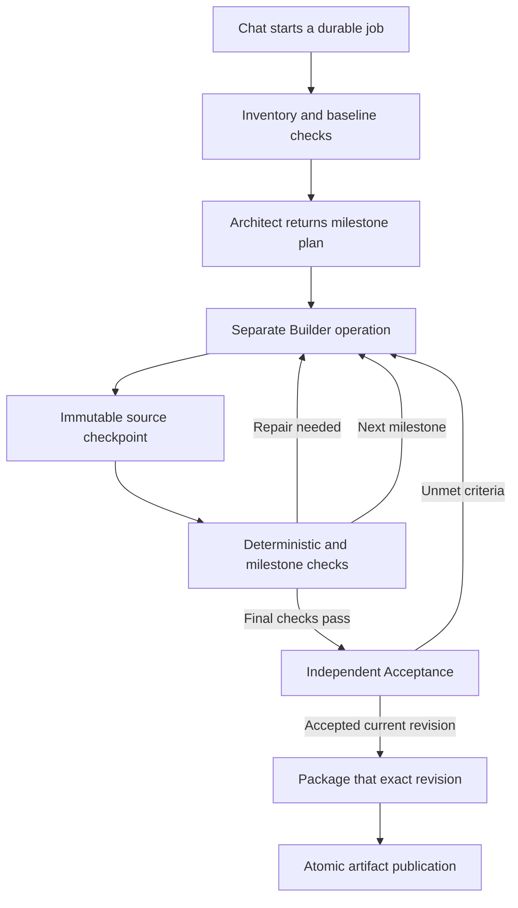

# Persistent Daedalus coding workflows

The new workflow is experimental and opt-in under **Settings → Daedalus → Use the new persistent Daedalus workflow for new jobs**. It has not passed its local-model quality evaluation; review generated changes and test coverage before use. It uses installed local Ollama models. Existing workflows retain their original execution path when the flag changes. The original Architect/Builder, Aider, and marker-format Fixer implementations remain available through the legacy path.

## Running a job

Choose the coding models in the existing model settings, configure the Daedalus context window, then request a build or upload a project and describe the desired change. Uploading prepares the project; it does not independently authorize edits. Source questions use the read-only Q&A mode.

The conversation starts one persistent job. The job card shows its milestone, model calls, elapsed execution time, context policy, checks, and source revision. Refreshing or closing the browser does not cancel it. **Stop** cancels the worker process and its subprocesses. If the worker is unreachable, the job stays `cancelling` until cancellation is acknowledged.

The default execution allowance is one hour, with 120 model calls. These are separate settings. Planning, coding, Acceptance, and compaction consume the same allowance. Commands have a separate timeout; browser actions and assertions use the visible browser-interaction timeout (15 seconds by default), so a missing element returns repair feedback without consuming the entire command allowance. When execution time expires, the controller requests cancellation and waits for worker acknowledgement before recording final usage and releasing its execution slot. A blocked job exposes **Continue from checkpoint**, granting another configured allowance. Continue first inspects the saved workspace. Changed source invalidates previous verification and Acceptance. Completed and cancelled jobs cannot be resumed.

An accepted download is the immutable revision that passed verification and independent Acceptance. Narrative messages announcing future work are continued within the Builder's turn allowance. Passing checks advance to the next milestone, or to independent Acceptance after the final milestone, even if the Builder did not emit a finish-tool event. A finish event is advisory; it does not replace verification or block progress after successful checks. Acceptance must still inspect the revision and confirm the complete requested behavior before delivery. Registration of the artifact, coding project, and completed job happens in one database transaction, fenced against Stop.

## Context settings

`backend/context_policy.py` owns application defaults. Inference call sites do not impose additional `num_ctx` floors or ceilings. The Settings page accepts arbitrary positive context values, including values above 128K. Physical memory and the selected model/runtime still determine what can actually run.

Precedence for Daedalus is:

1. An explicit stage override, if set.
2. The Daedalus context window.
3. The global context window, when Daedalus is set to inherit (`0`).

The Daedalus policy takes precedence over per-model chat presets. Existing Aider context overrides migrate into the visible Aider stage override. Settings display the effective value and its source for each stage. Helper model contexts are configurable separately, as is the existing research context setting.

Input allowance = context window − completion allowance − configured percentage headroom. Invalid combinations are rejected rather than silently enlarged. Automatic compaction can inherit the global choice, be enabled, or be disabled specifically for Daedalus. When disabled, a full context blocks the job and preserves its checkpoint.

Workers read the current policy at model-request boundaries. Saving settings also pushes the policy to active workers; the response reports workers whose acknowledgement is pending. A request already in progress finishes with the policy it started with. Increasing the execution allowance applies when starting/continuing a job; it does not extend an already-running subprocess deadline.

Coding chat also uses this policy: the browser does not trim its history to a per-model preset, and the backend has no fixed character ceiling for the coding conversation. Compaction preserves system instructions and complete tool interactions. The current Builder milestone and verified repair evidence replace the older attempt's request at inference time, keeping them outside the summarized history. Worker checkpoints reuse an unchanged summarized prefix and fold in new evidence, rather than summarizing the entire transcript on every subsequent call.

Prompt accounting includes message envelopes and tool definitions. Preflight counts use an approximate UTF-8 byte estimate, not a model-specific tokenizer. Actual usage is recorded separately and over-budget responses are rejected when the provider reports them. This does not establish exact token accounting for every possible tokenizer. Ollama's loaded context is checked before inference; allocation failures block visibly instead of silently shrinking the configured context.

## Execution ownership



The controller lives in `backend/coder_jobs.py`. Job ownership, replayable events, revisions, checks, and correlated runs live in the existing SQLite database through `backend/db/coder_jobs.py`. Migrations are additive. HyprChat remains a single-worker FastAPI application.

Each worker operation has a persisted idempotency key and its own subprocess. Workspace/process isolation uses Codebox’s existing LXC trust boundary; it is not a hardened OS sandbox for each job. Duplicate submissions reconnect to the existing operation. HyprChat restart recovery reattaches to persisted jobs without issuing a second coding attempt. Worker restarts can interrupt subprocesses depending on systemd's process-group policy; interrupted operations are marked for explicit continuation, using saved SDK sessions and source checkpoints.

Transient worker connection failures retain the current operation and reconnect. Restart recovery prioritizes operations already in progress before queued jobs. A periodic recovery pass also picks up committed jobs whose creating request disconnected before dispatch. Source-project identifiers are committed with the initial job, so recovery cannot start from half-initialized metadata. Continue confirms that the previous worker has stopped before starting another attempt; Stop retains the controller's execution slot until worker cancellation is acknowledged.

Architect and Builder remain separate model operations. Plans describe milestones and criteria. The controller discovers actual build/test commands after coding; new projects do not depend on invented test filenames. UI plans supply interaction steps, which the controller combines with a discovered preview server. Optional project-specific commands are syntax-checked before coding. Interface and file-layout guidance is advisory. The controller does not recreate the reverted single-turn architect auto-handoff or strict manifest-completeness gate.

If a verification plan does not match the actual project, the controller returns it to the Architect with current project evidence and the original request. Repeating the same incompatibility blocks the job; Continue grants another allowance and returns to planning. Checks are not silently discarded to make an invalid plan pass.

The new Builder uses the pinned OpenHands SDK in `backend/worker-requirements.txt`. Native tool support is probed; repeated native responses without calls switch the current operation to the SDK's text protocol. Complete, known JSON tool envelopes are normalized in both native and text modes before SDK argument validation. Current repair instructions are pinned before the SDK adds text-tool examples, so context compilation preserves those examples. SDK transport adaptation is isolated to an operation subprocess, and LiteLLM uses its bundled metadata rather than fetching a remote model catalog. One controller writer runs at a time; ordinary HyprChat chat/research may still share Ollama capacity.

## Large projects

Repository state lives outside the editable workspace. The worker maintains a SQLite inventory with file hashes, package locations, symbols, declared imports, and parser diagnostics. Python uses AST parsing; JavaScript/TypeScript use tree-sitter when installed. Unsupported or unparseable languages retain text navigation.

Inventory and search use cursors; source uses line or byte ranges with hashes. File and symbol queries accept literal substrings or `*`/`?` wildcards; file patterns match full relative paths or basenames, including nested tests. Root files get a separate overview so an earlier alphabetical directory cannot hide root-level manifests, docs, and tests. Missing source paths return indexed basename matches for the model to inspect. Accumulated verification collections are also paginated; the Builder receives a reference to the complete evidence file rather than every previous log in its prompt. This exposes the full eligible repository without placing it all into a model prompt. Embeddings are not required to start a job. The job card offers file, symbol, text, and import browsing, plus complete paginated verification logs and browser screenshots.

Git ignore rules and Settings directory exclusions apply. Upload, extracted-source, and worker-storage allowances are configurable. External symlinks are rejected. Checkpoints use a private Git object store; the project's own Git index is not used. The current import index records declared dependencies rather than providing a complete language-server semantic graph.

Deterministic discovery covers Node package scripts, dependency-free Node tests, Python environments/tests, Cargo, Go, Maven, and simple static sites/scripts. Mixed Python/Node packages run both sets of checks. Project-specific commands come from the Architect plan. Checks run on a copy of the exact revision with an isolated Python environment and sanitized package-manager variables. Successful check results are reusable for an unchanged revision when continuing. Verification that rewrites tracked source is rejected. Missing executables block as environment faults rather than consuming code-repair attempts.

Inventory tests cover 100K, 500K, and 1M lines. The local-model fixtures also include these sizes using unrelated padding sources. These tests establish pagination and isolation behavior; they do not establish success on every million-line monorepo. Storage is checked at operation boundaries and during project copy/upload, not enforced as a kernel filesystem quota. Very large dependency installs can require additional disk monitoring.

## Evaluation and promotion

The [2026-09-10 evaluation](evaluations/daedalus-2026-09-10.md) completed all 12 fixtures for each model. Qwen3 Coder 30B passed 2/12 and Devstral 24B passed 5/12; each produced one false acceptance. Neither qualified for promotion. The report preserves the evaluated source hashes and distinguishes subsequent recovery corrections.

`backend/evals/coder_fixtures.py` defines 12 fixtures: six greenfield and six existing-project edits. They include Python, JavaScript, browser behavior, and large source trees. Golden assertions run against the downloaded accepted archive, outside model context. They check requested behavior and preservation of unrelated files.

Run `python evals/check_sdk_contract.py` in the worker environment to check the pinned SDK's task serialization, text fallback, actual file editing, and completion using simulated responses. This includes a response stopped before its closing tool tag: complete JSON arguments are still required. It makes no inference requests. The live benchmark additionally requires `aiosqlite` from `backend/requirements.txt` in its isolated environment.

Run the benchmark against an **isolated worker and database**, with the backend modules available on Codebox:

```bash
/root/venv/bin/python3 evals/run_coder_benchmark.py \
  --state /tmp/daedalus-evaluation \
  --worker-url http://127.0.0.1:18586 \
  --ollama-url http://<OLLAMA_HOST>:11434 \
  --models qwen3-coder:30b devstral:24b \
  --projects-root /tmp/daedalus-evaluation-projects
```

Set the isolated worker's `DAEDALUS_STATE_DIR` and `DAEDALUS_PROJECTS_DIR` accordingly. Optional `--seconds`, `--calls`, and `--settings` arguments record explicit evaluation overrides. `--fixture` selects a smoke test. `--baseline` accepts results for the same fixtures and models from the previous workflow.

Promotion requires all 12 fixtures per model, at least 9 passing, zero false acceptances, and performance no worse than an available 12-case baseline. A missing baseline prevents promotion. The flag remains off by default; passing unit tests alone does not enable it. Preserve benchmark results with the source revision and settings used.

## Deployment and rollback

`deploy_monitor.py` watches the new backend, worker, and frontend modules. Worker changes include the shared context policy and pinned dependency manifest. Install worker requirements and the Playwright Chromium headless shell (`python -m playwright install chromium --only-shell`) before restarting `openhands-worker`; build the Vite frontend before shipping `frontend/dist`. Backend changes require a HyprChat restart and health/log checks.

Disable the persistent-workflow flag to route new jobs through the legacy implementation. Existing version-3 jobs retain their controller and remain inspectable. Stop active jobs before removing the new worker/controller files. Database migrations do not replace legacy workflow rows or remove existing tables.
