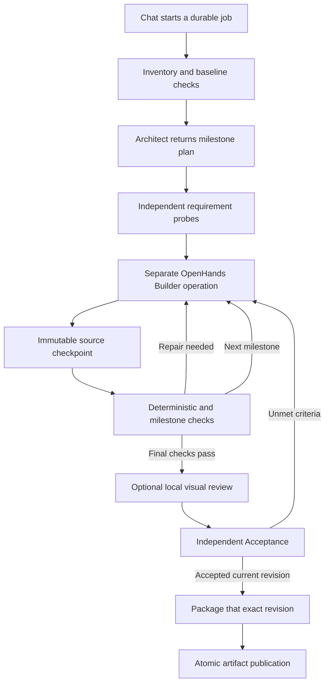

# Persistent Daedalus coding workflows

The new workflow is experimental and opt-in under **Settings → Daedalus → Use the new persistent Daedalus workflow for new jobs**. It has not passed its local-model quality evaluation; review generated changes and test coverage before use. It uses installed local Ollama models. Existing workflows retain their original execution path when the flag changes. The original Architect/Builder, Aider, and marker-format Fixer implementations remain available through the legacy path.

## Running a job

Choose the coding models in the existing model settings, configure the Daedalus context window, then request a build or upload a project and describe the desired change. Uploading prepares the project; it does not independently authorize edits. Source questions use the read-only Q&A mode.

New jobs use **policy version 6 within workflow v3**. Existing persisted jobs keep their earlier policy, drafts, retry counters and SDK tool types. This is separate from the legacy v2 workflow, whose Aider and fallback Fixer remain unchanged. OpenHands edits both new and existing projects in the persistent workflow.

The composer offers **Continue current project**, a registered project, or **Start a new project**. A project has a stable registry ID; each request has its own worker job and revision. Follow-up edits start from the last accepted artifact, including when the original worker workspace has disappeared. A second active editor for the same project is rejected. Publication advances the accepted head atomically; stale blocked jobs cannot overwrite a newer accepted revision. Older artifacts remain downloadable in **Project revisions**. Blocked or cancelled work can be exported explicitly as an **unverified checkpoint**, without advancing that head.

Accepted-archive recovery applies to fresh edit requests. Continuing unverified work still needs that job's saved worker workspace and checkpoint history; an accepted archive cannot recover unpublished changes from a lost worker disk.

The conversation starts one persistent job. Its compact card shows the phase, current activity and elapsed time; View details contains model/context usage, checks and source revisions. Refreshing or closing the browser does not cancel it. **Stop** cancels the worker process and its subprocesses. If the worker is unreachable, the job stays `cancelling` until cancellation is acknowledged.

The default execution allowance is one hour, with 120 model calls. These are separate settings. Planning, coding, Acceptance, and compaction consume the same allowance. Commands have a separate timeout; browser actions and assertions use the visible browser-interaction timeout (15 seconds by default), so a missing element returns repair feedback without consuming the entire command allowance. When execution time expires, the controller requests cancellation and waits for worker acknowledgement before recording final usage and releasing its execution slot. A blocked job exposes **Continue from checkpoint**, granting another configured allowance. Continue first inspects the saved workspace. Changed source invalidates previous verification and Acceptance. Completed jobs cannot be resumed. Cancelled policies before 7 retain their terminal behavior; policy 7 permits continuation after worker acknowledgement. Review candidates use the exact candidate continuation described below.

## Progress and coding controls

Project and AI visual review controls appear only for a Daedalus/coder persona,
including a pending persona on a new chat. Personal Assistant may keep CodeAgent
enabled without receiving these controls or their request fields. Leaving that
persona or changing conversations clears the request selections. A new chat with
no current project says **Start a new project**.

V3 messages show one compact job card with project name, phase, current activity,
elapsed time and last meaningful update. A composer status strip keeps the job
visible after streaming ends and while another persona is selected. The card,
strip and details use one shared workflow subscription and persisted event
sequences. A lost connection retains the last confirmed state and shows a
reconnection notice.

**View details** opens a desktop side panel or mobile sheet with Overview, Checks,
Files & logs and History. Detailed diagnostics, model/context counts, source
revision, original request, logs and downloads live there. **Complete** requires
accepted-artifact publication. Candidates say **Ready for review** only when
runnable, otherwise **Build incomplete**. Exhausted retained repair limits disable
Continue and explain why. Policy-7 Stop can resume after worker acknowledgement;
earlier cancelled policies retain their existing terminal behavior.

Policy 7 is implemented through the persistent controller and worker but new jobs
continue selecting policy 6 until its separate frozen release proof passes. See
[policy-7 qualification](daedalus-policy7-experiment.md). Neither that proof nor
this UI change makes v3 the default.

## Policy 6: one coding loop

The controller runs **inspect → baseline → compact work brief → Builder → project checks → independent review → accepted revision or review candidate**. Architect and Builder remain separate durable operations. There is no pre-build executable-probe authoring and no per-step Builder workflow. If bounded planning format recovery fails, Builder receives the original request and retained plan text; the reviewer reconstructs and verifies outcomes after implementation.

A work brief lists requested outcomes, explicit constraints, affected components, an approach, and suggested validation. Outcomes can require multiple kinds of evidence. For example, README plus runnable tests requires documentation and executed project tests. The controller assigns IDs, source hashes and execution references.

Execution profiles cover each discovered package. Commands resolve from explicit request/API commands, `.daedalus.json`, manifest adapters, then repository-validated proposals. Adapters cover Python, Node, Cargo, Go, Maven/Gradle, .NET, CMake/Make, Composer and Bundler. A static `index.html` retains its preview even when `package.json` supplies only test tooling. Python assertion scripts execute as scripts; unittest and pytest use their own runners. Examples without tests are not release gates. Missing tests, zero collected tests and printed success do not establish coverage. Configured failures remain visible, including failures recorded before edits.

Optional creation fields are `execution_commands` and `protected_files`. A project can also specify commands in `.daedalus.json`:

```json
{"packages":{".":{"setup":"python3 -m venv .venv","test":".venv/bin/python tests/check_api.py"}}}
```

Phases are `setup`, `build`, `lint`, `typecheck`, `test`, and `launch`; preview launch commands use `{port}`. Explicit natural-language commands quoted verbatim by Architect are retained as user commands. Proposed commands must reference existing repository files and cannot override configured commands. Dependency directories are reused only for matching manifests, setup commands and toolchain versions; editable installs are refreshed. Source copies, build products and execution results remain specific to a revision and operation.

Independent review happens after code exists. The reviewer sees the original request, actual source/interfaces, source diff, baseline results and execution logs. It authors ordinary native test files in a separate audit directory and commands run against disposable immutable-revision copies. `$DAEDALUS_PROJECT_ROOT` and `$DAEDALUS_AUDIT_DIR` identify those locations. Python import/executed-assertion evidence and Node V8 coverage record source bindings; directly executed binaries record their hash. Optional controller file assertions and browser actions remain available. Constants can be imported and asserted by identity/value without invocation. Only explicitly protected files may receive byte-for-byte preservation checks. Source mutations during checks invalidate the evidence.

The independent verdict diagnoses application defects, check defects, environment problems or ambiguity. Faulty checks are corrected before code repair, retaining both versions. Wording-only corrections are rejected. There are at most **two application-repair rounds** and **two accepted check-correction rounds** after initial implementation. Repeated failures or unchanged source receive one focused recovery before returning a candidate. Continue and restart do not reset these counters. Each repair gets a fresh SDK conversation containing the request, revision and relevant failures; interruptions within a round reuse its conversation. Builder may return a meaningful checkpoint without repeated `finish` prompts. Tool-mode selection is cached by installed-model digest, SDK/runtime and tool configuration.

Jobs expose optional `candidate_artifact`, `delivery_status`, and `verification_summary`. A **review candidate** contains the source revision, passed/failed/unverified outcomes, evidence references and run instructions. Its archive includes a `DAEDALUS_REVIEW_<revision>.json` report. The card labels it **Build incomplete** unless launch or execution succeeded, when it says **Ready for review**. **Continue** sends `candidate_revision` to the existing resume endpoint and requires that exact immutable revision. It reruns checks/review within the remaining repair limits. Normal project continuation starts from the accepted head. A candidate never changes the accepted artifact or head; ownership, writer exclusivity, cancellation acknowledgement and stale-publication fences still apply. Exhausted execution/context allowances retain a blocked checkpoint for explicit Continue.

The card displays Building, Checking, Repairing, Ready for review or Build incomplete, with evidence in the details panel. Visual review remains optional and off by default; text-only models can still author browser behavior checks.

Policy 6 has deterministic regression and saved-response journey coverage. The September 17 focused local-model pilot exercised new apps and uploaded projects against v2, but did not establish improved completion reliability: narration-only checkpoints, incomplete applications and faulty reviewer checks remained. It is not a reliability qualification. Keep v3 opt-in until a separately requested practical evaluation passes the promotion requirements below. Pilot logs and reports stay in ignored local artifacts; prior evaluation evidence is retained.

## Earlier persisted policies (unchanged)

The following protocols apply to existing policy 2–5 jobs only. Continue grants fresh visual-repair attempts. Policy-4 probe replacements and disputed-test audits remain persisted across Continue and restart; a new allowance cannot reset those limits. Earlier policies keep their previous correction behavior. Invalid Builder preview arguments, including a fixed port instead of the managed `{port}` placeholder, return actionable feedback before launching the server.

An accepted download is the immutable revision that passed verification and independent Acceptance. Narrative messages announcing future work are continued within the Builder's turn allowance. Passing checks advance to the next milestone, or to independent Acceptance after the final milestone, even if the Builder did not emit a finish-tool event. A finish event is advisory; it does not replace verification or block progress after successful checks. Acceptance must still inspect the revision and confirm the complete requested behavior before delivery. Registration of the artifact, coding project, and completed job happens in one database transaction, fenced against Stop.

Policy 3 separates requirement extraction from milestone planning. The controller supplies numbered request passages, materializes exact source quotations, and retains valid requirement slots when another slot needs correction. A separate read-only verifier authors one executable probe per nonvisual requirement; the controller assigns its check ID and coverage. Requested project tests use discovered test commands. Completed probe drafts survive operation interruption.

Policy 4 adds controller-executed API probes for ordinary Python and JavaScript functions. The verifier supplies a source path, exported function, JSON arguments and expected results. The controller imports and calls that export, checks values, Map entries, expected exceptions or exported sentinel identity, and optionally verifies unchanged inputs. Boolean false is distinct from zero; Python integer/float representations of the same number compare equally. Bindings resolve against the immutable checked revision and record source hashes. Missing requested exports fail verification; invented file-layout assumptions can be corrected after inspecting the built project.

Policy 5 adds `runner: "file"` with a project-relative `path` and `assertions` containing `exists`, `nonempty`, `contains` (literal `value`), or `unchanged`. Documentation checks bind directly to the documentation file; README checks cannot bind to application source. The controller records current hashes and obtains preservation hashes from the immutable baseline revision. File checks cannot establish API or browser behavior. Runner-specific schemas reject foreign fields and explicitly describe recursive JSON values for API arguments and expectations.

Diagnosis is saved before requesting a replacement check. Corrections must change executable assertions while retaining coverage and unrelated checks. A wording-only change is rejected. Each authoring step permits its initial schema response, one corrective schema response, one JSON-mode response, then one text-mode response under the same validation. Completed steps, rejected responses, inspections and consumed attempts survive restart and Continue. A valid negative review remains a negative verdict. Raw probes rejected by their semantic reviewer receive at most two revisions using the saved criticism; Continue cannot reset this limit. The existing two-audit and two-accepted-replacement limits also remain in force.

The details panel retains diagnoses, proposed/rejected checks and format recovery with failure links for these earlier policies. Audits receive their disputed requirement, check, failure and relevant source ranges. Requested-test coverage aliases reuse a discovered project-test execution on the same revision and environment, preserving every coverage link. Independently authored behavior probes execute separately.

Complex APIs, CLI/file checks and other languages retain executable probes with declared source bindings and a separate read-only review. Each review covers only its assigned requirement: documentation checks may assert file existence/content, while API checks must exercise the real API. Prospective greenfield checks are not rejected just because Builder has not created the files yet. Negative review verdicts are retained as evidence rather than retried as malformed responses. Python/JavaScript raw probes must directly import and call their bound subject. Copied, shadowed and unused subjects are rejected. This catches common verification mistakes; it is not a security proof of arbitrary test programs.

Failed independent checks receive structured `code_defect`, `probe_defect` or `ambiguous` audits, with explanations tied to the request, current source and failed assertion. A repair followed by the same failure gets a fresh audit. Audit keys include revision, probe hash, failure evidence and round. Two unresolved rounds on the same revision/probe/failure block verification. Each check may receive two replacements across the job, preserving identity and coverage; corrected probes rerun on the unchanged revision before any further Builder call. Audits consume the normal model/time allowance, not application repair attempts. The job card retains audit rationale and links to the associated logs, screenshots and traces.

Failed independent probes receive targeted diagnosis before further repair. A demonstrated probe defect needs an explanation and references to the original request; its correction cannot change the check ID or requirement mapping. An application defect keeps the probe unchanged. Acceptance still decides coverage and the verdict independently; the controller attaches matching checks from the current revision, and the validator rejects unsupported passing claims. Passing a build alone is insufficient. Known zero-test results, unexecuted Python test definitions, and nonthrowing JavaScript assertions do not establish successful verification. Repeated invalid responses and unchanged inspections stop with recorded evidence.

Structured-output requests use a JSON schema when available. A rejected schema or malformed response can fall back to JSON mode and then the text JSON contract within the same allowance. This is compatibility recovery, not relaxed validation. Existing policy-2 jobs retain their original requirement/probe protocol.

Verifier probes can request the discovered project test commands without inventing test filenames. The verifier can also evaluate JavaScript expressions in an empty Node VM context to check fixture construction; these experiments are language diagnostics, not evidence that the application works or a separate security boundary. Repeated invalid responses stop with the validation error. Repair context retains the current request and evidence once, preserving tool-call pairs through compaction.

These checks improve evidence quality; they do not make model-generated requirements or probes infallible. Unsupported platform verification (for example, a native macOS runtime on Linux Codebox) remains unverified and must be reported as such. A checkpoint export is available when the environment cannot finish verification.

## Browser testing and optional visual review

Codebox remains an LXC. Headless Chromium provides browser testing without a desktop VM. For UI tasks, the Builder receives a `daedalus_browser` tool returning accessible DOM, action results, errors, and evidence references as text. It can exercise clicks, form input, selection, keyboard actions, scrolling, reloads, visibility, and text assertions. Its results are diagnostic; final checks run separately on the saved revision.

Policy-4 jobs use the separately serialized `daedalus_browser_tool_v4` tool. Planning, verification, SDK export and browser execution share one strict action schema. Unsupported actions and fields receive precise errors. Forced clicks and arbitrary page scripts are unavailable. Text defaults to substring matching; exact row text includes adjacent button labels, so tests should target a text-only child when exact content matters. Normal actionability remains required, including for Delete buttons.

The `exists` assertion checks DOM presence without requiring visible dimensions, useful for initially empty output elements. Preview paths accept `/index.html` or `index.html`; external URL paths are rejected. The Builder can omit the preview command to use project discovery. Server startup has its own visible timeout, defaulting to 60 seconds, separate from browser interactions.

Use `exists` with `value: false` to assert deletion, and `visible` with `value: false` to assert hidden controls. A `text` assertion with `value: ""` requires an empty container; nonempty text matches a substring unless `exact: true` is supplied.

Final browser checks use desktop **1440×900** and mobile **390×844** by default; viewport dimensions are configurable in Settings. The job card exposes a live action timeline, screenshots, and downloadable Playwright traces, including failed checks. Replay traces locally with `npx playwright show-trace <trace.zip>`. Evidence downloads use opaque IDs checked against the current user's job. Console errors, failed requests, HTTP errors, and measurable horizontal overflow are reported for repair.

**AI visual review defaults to off.** Each request can inherit Settings, turn it off, or request it if supported. CLI, library, and other non-UI tasks skip it. When enabled, review uses the configured installed local vision model, or the coding model only if Ollama reports vision capability. It never downloads a model, substitutes a cloud model, or sends screenshots to a text-only model. Unsupported/unavailable optional vision is recorded as skipped; ordinary requirements can still pass. An explicit visual-verification requirement remains unmet and pauses for input. A blocked job's Continue control can change its visual-review setting.

Visual calls share the job's time and model-call allowances. Batches default to two screenshots, with a separately configurable image-token estimate; base64 data is excluded from text-token estimates and actual provider usage remains checked. Subjective suggestions stay advisory. Suspected clipping/overflow or obstructed controls must be reproduced by browser measurements before triggering an automatic repair. A changed source revision invalidates prior visual review.

## Context settings

`backend/context_policy.py` owns application defaults. Inference call sites do not impose additional `num_ctx` floors or ceilings. The Settings page accepts arbitrary positive context values, including values above 128K. Physical memory and the selected model/runtime still determine what can actually run.

Precedence for Daedalus is:

1. An explicit stage override, if set.
2. The Daedalus context window.
3. The global context window, when Daedalus is set to inherit (`0`).

The Daedalus policy takes precedence over per-model chat presets. Existing Aider context overrides migrate into the visible Aider stage override. Settings display the effective value and its source for each stage. Helper model contexts are configurable separately, as is the existing research context setting.

Each stage also has an optional completion-token override and thinking preference. Unset outputs inherit the global completion allowance; thinking can inherit, be disabled, be enabled, or select a supported reasoning level. Capability checks avoid sending unsupported thinking options. Policy-3 operations apply these choices at the actual inference boundary; older persisted jobs ignore the new per-stage output/thinking overrides.

Input allowance = context window − completion allowance − configured percentage headroom. Invalid combinations are rejected rather than silently enlarged. Automatic compaction can inherit the global choice, be enabled, or be disabled specifically for Daedalus. When disabled, a full context blocks the job and preserves its checkpoint.

Workers read the current policy at model-request boundaries. Saving settings also pushes the policy to active workers; the response reports workers whose acknowledgement is pending. A request already in progress finishes with the policy it started with. Increasing the execution allowance applies when starting/continuing a job; it does not extend an already-running subprocess deadline.

Coding chat also uses this policy: the browser does not trim its history to a per-model preset, and the backend has no fixed character ceiling for the coding conversation. Compaction preserves system instructions and complete tool interactions. The current Builder milestone and verified repair evidence replace the older attempt's request at inference time, keeping them outside the summarized history. Worker checkpoints reuse an unchanged summarized prefix and fold in new evidence, rather than summarizing the entire transcript on every subsequent call.

Prompt accounting includes message envelopes and tool definitions. Preflight counts use an approximate UTF-8 byte estimate, not a model-specific tokenizer. Actual usage is recorded separately and over-budget responses are rejected when the provider reports them. This does not establish exact token accounting for every possible tokenizer. Ollama's loaded context is checked before inference; allocation failures block visibly instead of silently shrinking the configured context.

## Execution ownership


```mermaid
flowchart TD
    A[Chat starts a durable job] --> B[Inventory and baseline checks]
    B --> C[Architect returns milestone plan]
    C --> V[Independent requirement probes]
    V --> D[Separate OpenHands Builder operation]
    D --> E[Immutable source checkpoint]
    E --> F[Deterministic and milestone checks]
    F -->|Repair needed| D
    F -->|Next milestone| D
    F -->|Final checks pass| W[Optional local visual review]
    W --> G[Independent Acceptance]
    G -->|Unmet criteria| D
    G -->|Accepted current revision| H[Package that exact revision]
    H --> I[Atomic artifact publication]
```

The controller lives in `backend/coder_jobs.py`. Job ownership, replayable events, revisions, checks, and correlated runs live in the existing SQLite database through `backend/db/coder_jobs.py`. Migrations are additive. HyprChat remains a single-worker FastAPI application.

Each worker operation has a persisted idempotency key and its own subprocess. Workspace/process isolation uses Codebox’s existing LXC trust boundary; it is not a hardened OS sandbox for each job. Duplicate submissions reconnect to the existing operation. HyprChat restart recovery reattaches to persisted jobs without issuing a second coding attempt. Worker restarts can interrupt subprocesses depending on systemd's process-group policy; interrupted operations are marked for explicit continuation, using saved SDK sessions and source checkpoints.

Transient worker connection failures retain the current operation and reconnect. Restart recovery prioritizes operations already in progress before queued jobs. A periodic recovery pass also picks up committed jobs whose creating request disconnected before dispatch. Source-project identifiers are committed with the initial job, so recovery cannot start from half-initialized metadata. Continue confirms that the previous worker has stopped before starting another attempt; Stop retains the controller's execution slot until worker cancellation is acknowledged.

Architect and Builder remain separate model operations. Plans describe milestones and criteria. The controller discovers actual build/test commands after coding; new projects do not depend on invented test filenames. UI plans supply interaction steps, which the controller combines with a discovered preview server. Optional project-specific commands are syntax-checked before coding. Interface and file-layout guidance is advisory. The controller does not recreate the reverted single-turn architect auto-handoff or strict manifest-completeness gate.

If a verification plan does not match the actual project, the controller returns it to the Architect with current project evidence and the original request. Repeating the same incompatibility blocks the job; Continue grants another allowance and returns to planning. Checks are not silently discarded to make an invalid plan pass.

The new Builder uses the pinned OpenHands SDK in `backend/worker-requirements.txt`. Native tool support is probed; repeated native responses without calls switch the current operation to the SDK's text protocol. Complete, known JSON tool envelopes are normalized in both native and text modes before SDK argument validation. Current repair instructions are pinned before the SDK adds text-tool examples, so context compilation preserves those examples. SDK transport adaptation is isolated to an operation subprocess, and LiteLLM uses its bundled metadata rather than fetching a remote model catalog. One controller writer runs at a time; ordinary HyprChat chat/research may still share Ollama capacity.

For policy-3 jobs, an Ollama malformed-native-tool error permits one immediate retry through the SDK's text protocol, before any action from that rejected response executes. The selected mode is persisted for subsequent operations; both inference attempts count. The SDK can execute batches of tool calls, but its text-history converter expects one call per message. The adapter splits batched assistant messages only in the inference copy of saved history, preserving all calls, IDs, observations, and original execution state. This prevents native-to-text transitions from failing on earlier successful batches without replaying those actions. Network and application errors do not trigger this protocol fallback. Blocked job cards show the failure category, stage, recovery attempt, and a suggested next action alongside the original evidence.

## Large projects

Repository state lives outside the editable workspace. The worker maintains a SQLite inventory with file hashes, package locations, symbols, declared imports, and parser diagnostics. Python uses AST parsing; JavaScript/TypeScript use tree-sitter when installed. Unsupported or unparseable languages retain text navigation.

Inventory and search use cursors; source uses line or byte ranges with hashes. File and symbol queries accept literal substrings or `*`/`?` wildcards; file patterns match full relative paths or basenames, including nested tests. Root files get a separate overview so an earlier alphabetical directory cannot hide root-level manifests, docs, and tests. Missing source paths return indexed basename matches for the model to inspect. Accumulated verification collections are also paginated; the Builder receives a reference to the complete evidence file rather than every previous log in its prompt. This exposes the full eligible repository without placing it all into a model prompt. Embeddings are not required to start a job. The job card offers file, symbol, text, and import browsing, plus complete paginated verification logs and browser screenshots.

Git ignore rules and Settings directory exclusions apply. Upload, extracted-source, and worker-storage allowances are configurable. External symlinks are rejected. Checkpoints use a private Git object store; the project's own Git index is not used. The current import index records declared dependencies rather than providing a complete language-server semantic graph.

The worker also checks a configurable free-space reserve (default 1 GB). Accepted archive transfers validate their checksum and compressed/expanded size before extraction. Dependency installs still use the LXC's shared disk rather than a per-job filesystem quota.

Deterministic discovery covers Node package scripts, dependency-free Node tests, Python environments/tests, Cargo, Go, Maven, and simple static sites/scripts. Mixed Python/Node packages run both sets of checks. Project-specific commands come from the Architect plan. Checks run on a copy of the exact revision with an isolated Python environment and sanitized package-manager variables. Successful check results are reusable for an unchanged revision when continuing. Verification that rewrites tracked source is rejected. Missing executables block as environment faults rather than consuming code-repair attempts.

Inventory tests cover 100K, 500K, and 1M lines. The local-model fixtures also include these sizes using unrelated padding sources. These tests establish pagination and isolation behavior; they do not establish success on every million-line monorepo. Storage is checked at operation boundaries and during project copy/upload, not enforced as a kernel filesystem quota. Very large dependency installs can require additional disk monitoring.

## Evaluation and promotion

The [2026-09-16 reliability evaluation](evaluations/daedalus-2026-09-16.md) records the deployed policy-3 candidate, model-profile comparison, and current rollout status.

The completed [policy-5 evaluation](evaluations/daedalus-policy5-2026-09-16.md) rejected promotion: Qwen3.6 35B passed 5/7 focused cases, Qwen3.6 27B passed 4/7, and Qwen3 Coder 30B passed 1/7. The first two models passed both follow-up edits; Coder had no accepted initial artifact for its edits. Zero false acceptances were observed. No configuration reached the full matrices, matched legacy baseline or live API journeys; production remains opt-in and unchanged. The [policy-4 evaluation](evaluations/daedalus-policy4-2026-09-16.md) remains separate historical evidence. `--profile reliability` uses the installed local model with 65,536 context, 16,384 output tokens and thinking on for Architect/verifier/Acceptance, and 8,192 with thinking off for Builder. The one-hour/120-call limits remain unchanged. These are explicit evaluation settings, not new production defaults.

`evals/run_coder_rollout.py` orchestrates the focused pilot, two full matrices, matched real legacy baseline and API journeys on isolated workers. It requires fresh state and never enables production Settings. All seven focused fixtures, both grouping edits, original artifact preservation and zero false acceptances must pass before full evaluation starts. If the current model fails its focused pilot, the queue runs the bounded installed-model comparison with `qwen3.6:27b` and `qwen3-coder:30b`. Only complete passing pilots with both edits qualify; fewer actual calls, then elapsed time, choose between passing alternatives. If none qualify, the queue stops and retains every result. Preflight checks dependencies, browser startup, separate worker state, disk-backed storage and archive transfer. The restoration worker must use `/root/projects` to see Codebox uploads. Use disk-backed state under `/var/lib/daedalus-evaluations`, not the LXC's RAM-backed `/tmp`.

The [2026-09-15 implementation and evaluation](evaluations/daedalus-2026-09-15.md) records the deployed policy-2 changes, software checks, and a frozen local-model matrix: 6/12 passes, zero false acceptances, and failed large-project/follow-up gates. The workflow remains experimental and off by default.

The [2026-09-10 evaluation](evaluations/daedalus-2026-09-10.md) completed all 12 fixtures for each model. Qwen3 Coder 30B passed 2/12 and Devstral 24B passed 5/12; each produced one false acceptance. Neither qualified for promotion. The report preserves the evaluated source hashes and distinguishes subsequent recovery corrections.

`backend/evals/coder_fixtures.py` defines 12 fixtures: six greenfield and six existing-project edits. They include Python, JavaScript, browser behavior, and large source trees. Golden assertions run against the downloaded accepted archive, outside model context. They check requested behavior and preservation of unrelated files.

Run `python evals/check_sdk_contract.py` in the worker environment to check the pinned SDK's task serialization, text fallback, actual file editing, and completion using simulated responses. This includes a response stopped before its closing tool tag: complete JSON arguments are still required. It makes no inference requests. The live benchmark additionally requires `aiosqlite` from `backend/requirements.txt` in its isolated environment.

Run the benchmark against an **isolated worker and database**, with the backend modules available on Codebox:

```bash
/root/venv/bin/python3 evals/run_coder_benchmark.py \
  --state /var/lib/daedalus-evaluations/run-1 \
  --worker-url http://127.0.0.1:18586 \
  --ollama-url http://<OLLAMA_HOST>:11434 \
  --models qwen3-coder:30b devstral:24b \
  --projects-root /var/lib/daedalus-evaluations/projects
```

Set the isolated worker's `DAEDALUS_STATE_DIR` and `DAEDALUS_PROJECTS_DIR` accordingly. Optional `--seconds`, `--calls`, and `--settings` arguments record explicit evaluation overrides. `--fixture` selects a smoke test. `--baseline` accepts legacy results declaring `workflow_version: 2`, with matching fixture-source hash, installed model digests/details, and recorded context/execution allowances. A prior v3 report is not a legacy baseline.

Use disk-backed storage for long evaluations. Codebox's `/tmp` is RAM-backed; accumulated snapshots, dependencies, and browser evidence can exhaust the container's memory even when `df` reports free space. Preserve reports and artifacts before reclaiming inactive runs.

`--followups` adds two consecutive changes to the accepted `grouping` project and verifies that its original artifact remains unchanged. Run optional-vision evaluation separately from the text-only baseline. Smoke tests and mocked capability tests do not satisfy the 12-case promotion gate or establish vision-model quality.

For the policy-3 comparison, `--profile A` uses 8,192 output tokens with thinking off for every stage. `--profile B` gives Architect, verifier, and Acceptance 16,384 output tokens with thinking on; Builder retains 8,192 with thinking off. Both use a 32,768 context and a one-hour/120-call allowance. These are recorded evaluation overrides, not production defaults. An isolated inference proxy counts actual requests for both workflows. `--workflow-version 2` exercises the real legacy dispatcher, Aider fallback, and workflow gates; it requires a worker whose registration root is `/root/projects`, using unique `eval-*` directories.

Choose the profile using completed focused pilots, then freeze source and settings. Promotion requires **two separate complete twelve-case matrices** on that candidate, each passing all twelve fixtures, every large fixture passing, zero false acceptances, successful grouping follow-ups, and no regression against the matched real legacy baseline. Missing or duplicate fixtures prevent promotion. Run `evals/run_coder_journeys.py` against two isolated workers to test a real web build plus two edits, a ZIP-uploaded CLI repair plus feature request, and accepted-archive restoration on a fresh worker. It checks downloaded artifacts and preservation of original artifacts.

`python evals/rollout_gate.py --first <matrix-1.json> --second <matrix-2.json> --baseline <legacy.json> --journeys <journeys.json>` validates matching source hashes, model digests, settings, distinct jobs, and all required outcomes. It never changes Settings. Deployment health must also pass before enabling the default. Passing software tests alone does not enable the workflow. Preserve raw reports with the source and settings used; never combine results from changed candidates.

## Deployment and rollback

`deploy_monitor.py` watches the new backend, worker, and frontend modules. Worker changes include the shared context policy and pinned dependency manifest. Install worker requirements and the Playwright Chromium headless shell (`python -m playwright install chromium --only-shell`) before restarting `openhands-worker`; build the Vite frontend before shipping `frontend/dist`. Backend changes require a HyprChat restart and health/log checks.

Disable the persistent-workflow flag to route new jobs through the legacy implementation. Existing version-3 jobs retain their controller and remain inspectable. Stop active jobs before removing the new worker/controller files. Database migrations do not replace legacy workflow rows or remove existing tables.

Codebox is CT **115 on pve2**. Its persistent Proxmox DNS resolver is `192.168.1.1`; the running guest uses the same resolver. The previous inherited Tailscale resolvers were unreachable while Tailscale was inactive in this guest, preventing package downloads. Configuration-only backups from the correction are private on pve2 under `/root/daedalus-dns-backup-20260915/`. They are not guest-data backups.
